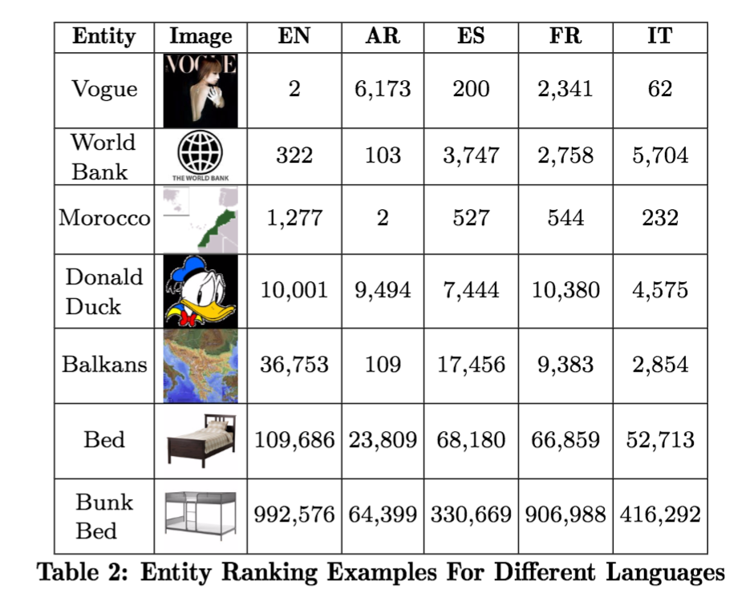

### Usage ###
The following datasets are licensed under a [Creative Commons Attribution 3.0 Unported License](http://creativecommons.org/licenses/by/3.0/).

We have uploaded the top `500,000` ranked entities for `Arabic`, `English`, `Spanish`, `French` and `Italian` languages. If you wish to get the full ranked list for each language, please contact us. 

### Download ###

[Entity Rank - Arabic - 2017-01-03](dataset/entity_rank_ar.txt) 

[Entity Rank - English - 2017-01-03](dataset/entity_rank_en.txt)

[Entity Rank - Spanish - 2017-01-03](dataset/entity_rank_es.txt)

[Entity Rank - French - 2017-01-03](dataset/entity_rank_fr.txt)

[Entity Rank - Italian - 2017-01-03](dataset/entity_rank_it.txt)

### File Format ###

The data is encoded as UTF-8 text in comma-separated format. The columns in the dataset are defined as:

* entityId (string) - This is the freebase machine Id of an entity. 
* rank (int)

### Example ###

| entityId|rank| 
|:-------:|-------| 
| [08k9h](https://www.google.com/search?q=knowledge+graph+search+api&kponly&kgmid=/m/08k9h)   | 0 |
| [05k79](https://www.google.com/search?q=knowledge+graph+search+api&kponly&kgmid=/m/05k79)   | 1 |
| [01y5zy](https://www.google.com/search?q=knowledge+graph+search+api&kponly&kgmid=/m/01y5zy) | 2 |
| [014l6l](https://www.google.com/search?q=knowledge+graph+search+api&kponly&kgmid=/m/014l6l) | 3 |
| [08w4pm](https://www.google.com/search?q=knowledge+graph+search+api&kponly&kgmid=/m/08w4pm) | 4 |
| [01hryy](https://www.google.com/search?q=knowledge+graph+search+api&kponly&kgmid=/m/01hryy) | 5 |

### Citing ###

If you use the dataset, please cite:
```
Prantik Bhattacharyya and Nemanja Spasojevic,
Global Entity Ranking Across Multiple Languages,
https://github.com/opendata, 
03 01, 2017
```
and

```
Prantik Bhattacharyya and Nemanja Spasojevic. 
Global Entity Ranking Across Multiple Languages. 
In Proc. of ACM World Wide Web Conference 2017 (WWW’17)
```

BibTex:
```
@inproceedings{klout:entity_rank,
 author = {Prantik Bhattacharyya and Nemanja Spasojevic,
 title = {Global Entity Ranking Across Multiple Languages},
 howpublished = "\url{https://github.com/klout/opendata}",
 edition = "03 01, 2017"
}
```
```
@InProceedings{Bhattacharyya-importance,
  author       = {Bhattacharyya, Prantik and Spasojevic, Nemanja},
  title        = {Global Entity Ranking Across Multiple Languages},
  booktitle    = {Proc. of ACM World Wide Web Conference 2017 (WWW'17)},
  pages        = {to appear},
  organization = {ACM},
}
```

### Appendex ###




