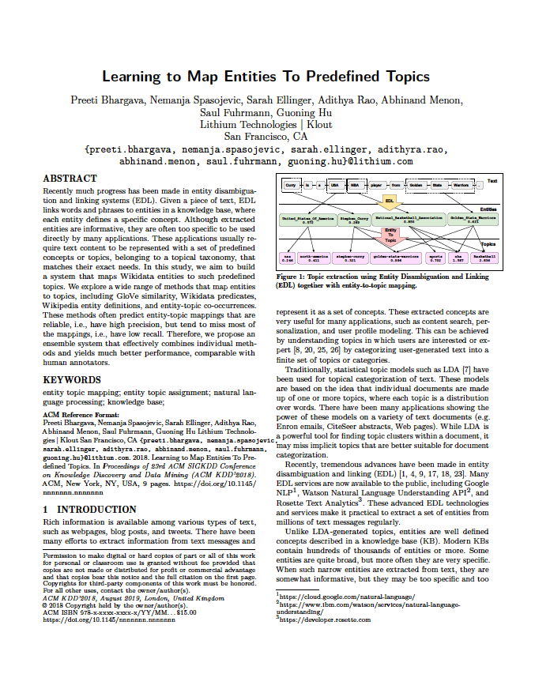

### Usage ###
The following datasets are licensed under a [Creative Commons Attribution 3.0 Unported License](http://creativecommons.org/licenses/by/3.0/).

### Download ###

[Entity To Topics Labels - 2018-01-01](dataset/entity_to_topic_labels_20180101.csv) 

[Entity To Topic Projections - 2018-06-01](dataset/entity_to_klout_topic_mapping_20180601.txt) 
[readable sample](dataset/entity_to_klout_topic_mapping_example_20180601.txt)

### Entity To Topics Labels File Format ###

The data is encoded as UTF-8 text in tab-separated format. The columns in the dataset are defined as:

* entityId (string)
* entityDisplayName (string)
* topicId (signed int64)
* topicDisplayName (string)
* label ('0', or '1')
### Example ###

|entityId|entityDisplayName|topicId|topicDisplayName|label| 
|:----|------------------------------|:---:|------------------------------|---|
| **Q312**| Apple Inc|	9219221220892056455| Consumer Electronics| 1 |
| **Q312**| Apple Inc|	5432819378070905100| Food| 0 |

### Entity To Topics Mappings File Format ###

The data is encoded as UTF-8 text in tab-separated format. There are 2 columns:

* entityId (string)
* topicMappings (string) - string encoding map of topic to entities formated as ```topic1:weight1,topic2:weight2,...```

Entity id is WikidData ID so for example **Apple inc** has Q312 that one can look up here [https://wikidata.org/wiki/Q312](https://wikidata.org/wiki/Q312).
The topic id's refer to Klout Topic Id's - for more info check paper [Klout Topics for Modeling Interests and Expertise of Users Across Social Networks](https://arxiv.org/pdf/1710.09824.pdf), 
or opendata page [https://github.com/klout/opendata/tree/master/klout_topic_ontology](https://github.com/klout/opendata/tree/master/klout_topic_ontology).

Example:
```
Q89-Apple	8034640083435133362-Agriculture:0.54,9159-Vegetables:0.516,12621-Desserts:0.509,10000000000000016450-History:0.42,8065424964741862621-Gardening:0.41600000000000004
Q847-Tennis	8582816108322908713-Tennis:1.68,7008943767379250621-Sports:0.984,7422309137691522635-Wimbledon Championships:0.382,10000000000000008948-Women's Tennis Association:0.379,10000000000000009425-ATP World Tour:0.371
Q1144447-Modeling agency	5553113223778426161-Fashion:0.625,6136498691401480079-Advertising:0.62,10000000000000000010-Fashion Modeling:0.5640000000000001,10000000000000018433-Magazines:0.369,8579312127380248579-Tokyo:0.357
Q2144402-Renovation	10000000000000016891-Remodeling:1.166,10000000000000016633-Art and Artists:0.717,6100538096159987988-Architecture:0.661,10000000000000019061-Art Conservation:0.619,5909188256639465585-Museums:0.608
Q312-Apple Inc.	8283952755688430877-Apple:1.495,14711-Computers:0.718,62252-Steve Jobs:0.5640000000000001,6262978593860350993-iPhones:0.551,4717631801849228063-Smartphones:0.543
Q1379733-Presidency of Barack Obama	10000000000000017206-U.S. Presidents:1.236,8119426466902417284-Politics:0.876,6546181264255455413-Barack Obama:0.579,1212-U.S. Federal Government:0.452,5939412104278976053-Democratic Party:0.356
Q13133-Michelle Obama	1434-Michelle Obama:1.316,10000000000000017235-U.S. First Ladies:1.087,8119426466902417284-Politics:0.758,10000000000000017206-U.S. Presidents:0.682,6546181264255455413-Barack Obama:0.503
Q5372-Basketball	8582816108322807207-Basketball:1.989,7008943767379250621-Sports:1.5,6467710261455026125-NBA:0.607,8582816108322807145-Baseball:0.43,8582816108322836738-Football:0.298
Q3284399-Statistical model	5039263846244636705-Math:1.682,7427443074777217903-Statistics:0.914,9219221220892053545-Probability:0.464,6730862071429684710-Computer Science:0.44,8582816108322829850-Econometrics:0.327
Q5449731	7771967763877694528-Finance:0.782,5039263846244636705-Math:0.684,4773694330785986652-Accounting:0.31,7379556855959307703-Engineering:0.266,6011700363202204797-Business:0.253
Q2407-C++	10000000000000016434-Computer Programming:0.96,6730862071429684710-Computer Science:0.606,8226386291923137474-Software Development:0.37,6977450917085085463-Java:0.352,8389956153950126978-Python:0.337
Q9143-Programming language	10000000000000016434-Computer Programming:1.359,6730862071429684710-Computer Science:0.836,5144818194631006088-Software:0.674,6977450917085085463-Java:0.444,8226386291923137474-Software Development:0.333
Q3621696-Language model	6730862071429684710-Computer Science:0.979,9219221220892056753-Natural Language Processing:0.558,5039263846244636705-Math:0.506,8226386291923137474-Software Development:0.466,10000000000000018980-Computational Linguistics:0.443
Q621427-IPhone (1st generation)	4717631801849228063-Smartphones:0.994,8283952755688430877-Apple:0.9390000000000001,8582816108322821925-Computer Hardware:0.732,6262978593860350993-iPhones:0.664,6490289872610913965-Telecommunications:0.55
Q1414593-Patient Protection and Affordable Care Act	10000000000000017233-Affordable Care Act:1.283,8300967504229016380-Health Care:0.811,2006-Health Insurance:0.797,8119426466902417284-Politics:0.796,10000000000000017206-U.S. Presidents:0.657

```

Example with debug display:
```
Q89-Apple	8034640083435133362-Agriculture:0.54,9159-Vegetables:0.516,12621-Desserts:0.509,10000000000000016450-History:0.42,8065424964741862621-Gardening:0.41600000000000004
Q847-Tennis	8582816108322908713-Tennis:1.68,7008943767379250621-Sports:0.984,7422309137691522635-Wimbledon Championships:0.382,10000000000000008948-Women's Tennis Association:0.379,10000000000000009425-ATP World Tour:0.371
Q1144447-Modeling agency	5553113223778426161-Fashion:0.625,6136498691401480079-Advertising:0.62,10000000000000000010-Fashion Modeling:0.5640000000000001,10000000000000018433-Magazines:0.369,8579312127380248579-Tokyo:0.357
Q2144402-Renovation	10000000000000016891-Remodeling:1.166,10000000000000016633-Art and Artists:0.717,6100538096159987988-Architecture:0.661,10000000000000019061-Art Conservation:0.619,5909188256639465585-Museums:0.608
Q312-Apple Inc.	8283952755688430877-Apple:1.495,14711-Computers:0.718,62252-Steve Jobs:0.5640000000000001,6262978593860350993-iPhones:0.551,4717631801849228063-Smartphones:0.543
Q1379733-Presidency of Barack Obama	10000000000000017206-U.S. Presidents:1.236,8119426466902417284-Politics:0.876,6546181264255455413-Barack Obama:0.579,1212-U.S. Federal Government:0.452,5939412104278976053-Democratic Party:0.356
Q13133-Michelle Obama	1434-Michelle Obama:1.316,10000000000000017235-U.S. First Ladies:1.087,8119426466902417284-Politics:0.758,10000000000000017206-U.S. Presidents:0.682,6546181264255455413-Barack Obama:0.503
Q5372-Basketball	8582816108322807207-Basketball:1.989,7008943767379250621-Sports:1.5,6467710261455026125-NBA:0.607,8582816108322807145-Baseball:0.43,8582816108322836738-Football:0.298
Q3284399-Statistical model	5039263846244636705-Math:1.682,7427443074777217903-Statistics:0.914,9219221220892053545-Probability:0.464,6730862071429684710-Computer Science:0.44,8582816108322829850-Econometrics:0.327
Q5449731	7771967763877694528-Finance:0.782,5039263846244636705-Math:0.684,4773694330785986652-Accounting:0.31,7379556855959307703-Engineering:0.266,6011700363202204797-Business:0.253
Q2407-C++	10000000000000016434-Computer Programming:0.96,6730862071429684710-Computer Science:0.606,8226386291923137474-Software Development:0.37,6977450917085085463-Java:0.352,8389956153950126978-Python:0.337
Q9143-Programming language	10000000000000016434-Computer Programming:1.359,6730862071429684710-Computer Science:0.836,5144818194631006088-Software:0.674,6977450917085085463-Java:0.444,8226386291923137474-Software Development:0.333
Q3621696-Language model	6730862071429684710-Computer Science:0.979,9219221220892056753-Natural Language Processing:0.558,5039263846244636705-Math:0.506,8226386291923137474-Software Development:0.466,10000000000000018980-Computational Linguistics:0.443
Q621427-IPhone (1st generation)	4717631801849228063-Smartphones:0.994,8283952755688430877-Apple:0.9390000000000001,8582816108322821925-Computer Hardware:0.732,6262978593860350993-iPhones:0.664,6490289872610913965-Telecommunications:0.55
Q1414593-Patient Protection and Affordable Care Act	10000000000000017233-Affordable Care Act:1.283,8300967504229016380-Health Care:0.811,2006-Health Insurance:0.797,8119426466902417284-Politics:0.796,10000000000000017206-U.S. Presidents:0.657

```

### Citing ###

If you use the dataset, please cite:
```
Klout, 
Klout Topic Ontology, 
https://github.com/opendata, 
07 08, 2015
```

BibTex:
```
@inproceedings{klout:entity_to_topic,
 author = {Preeti Bhargava, Nemanja Spasojevic, Sarah Ellinger, Adithya Rao, Abhinand Menon, Saul Fuhrmann, Guoning Hu}
 title = {Learning To Map Entities To Predefined Topics},
 howpublished = "\url{https://github.com/klout/opendata}",
 edition = "TBD"
}
```


