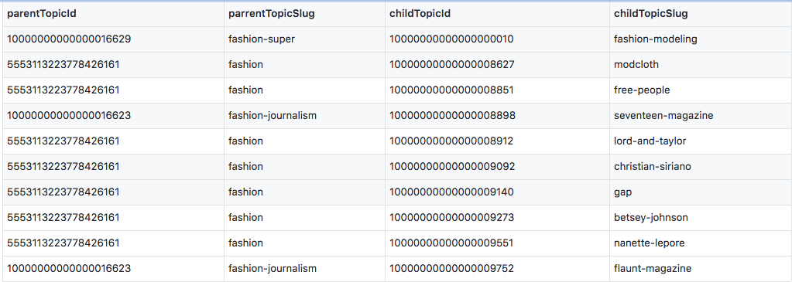
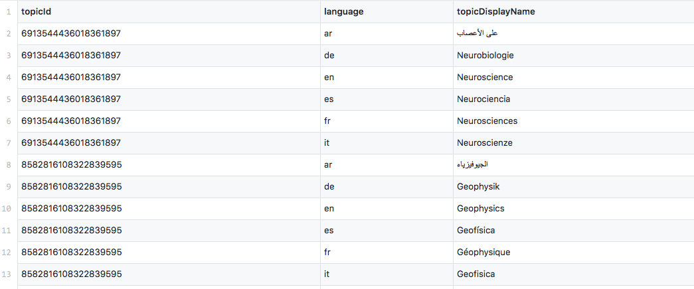
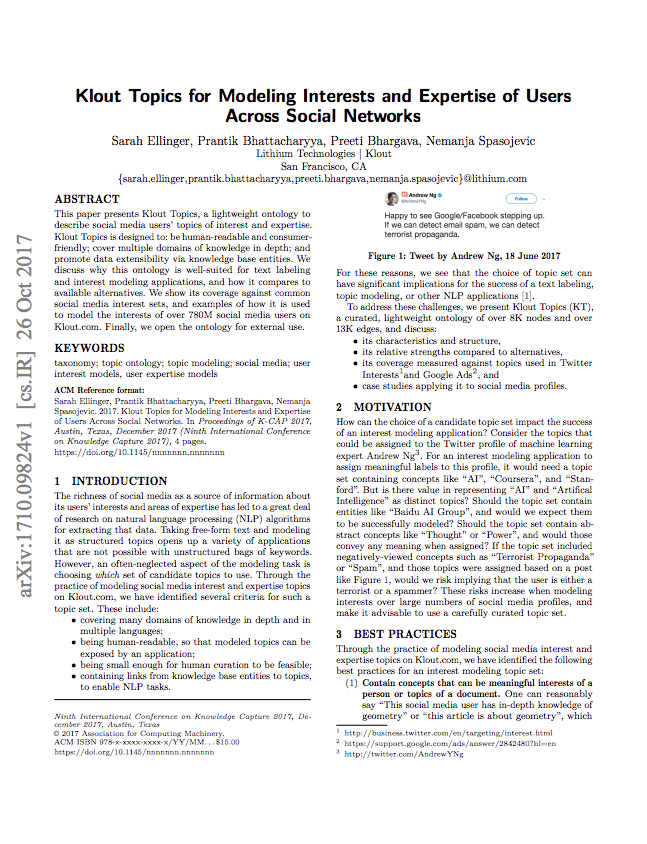

### Usage ###
The following datasets are licensed under a [Creative Commons Attribution 3.0 Unported License](http://creativecommons.org/licenses/by/3.0/).

### Download ###

[Klout Topic Ontology - 2018-06-01](dataset/klout_topic_ontology_20180601.csv) [(sample)](dataset/klout_topic_ontology_20180601_sample.csv) 

[Klout Topic Edges - 2018-06-01](dataset/klout_topic_edge_20180601.csv) [(sample)](dataset/klout_topic_edge_20180601_sample.csv) 

[Klout Topic Display Names - 2018-06-01](dataset/klout_topic_display_20180601.csv) [(sample)](dataset/klout_topic_display_20180601_sample.csv) 

### Ontology File Format ###

The data is encoded as UTF-8 text in comma-separated format. The columns in the dataset are defined as:

* topicId (signed int64)
* topicSlug (string)
* topicDisplayName (string)
* wikiItemId (string)
* freebaseMachineId (string)

#### Example #### 


### Topic Edges File Format ###

The data is encoded as UTF-8 text in comma-separated format. The columns in the dataset are defined as:

* parentTopicId (signed int64)
* parentTopicSlug (string)
* childTopicId (signed int64)
* childTopicSlug (string)

#### Example #### 


### Display Names File Format ###

The data is encoded as UTF-8 text in comma-separated format. The columns in the dataset are defined as:

* topicId (signed int64)
* language (string)
* topicDisplayName (string)

#### Example #### 



### Citing ###


If you use the dataset, please cite:
```
Klout, 
Klout Topic Ontology, 
https://github.com/opendata, 
07 08, 2015
```

BibTex:
```
@article{DBLP:journals/corr/abs-1710-09824,
  author    = {Sarah Ellinger and
               Prantik Bhattacharyya and
               Preeti Bhargava and
               Nemanja Spasojevic},
  title     = {Klout Topics for Modeling Interests and Expertise of Users Across
               Social Networks},
  journal   = {CoRR},
  volume    = {abs/1710.09824},
  year      = {2017},
  url       = {http://arxiv.org/abs/1710.09824},
  archivePrefix = {arXiv},
  eprint    = {1710.09824},
  timestamp = {Thu, 02 Nov 2017 14:25:36 +0100},
  biburl    = {http://dblp.org/rec/bib/journals/corr/abs-1710-09824},
  bibsource = {dblp computer science bibliography, http://dblp.org}
}
```


