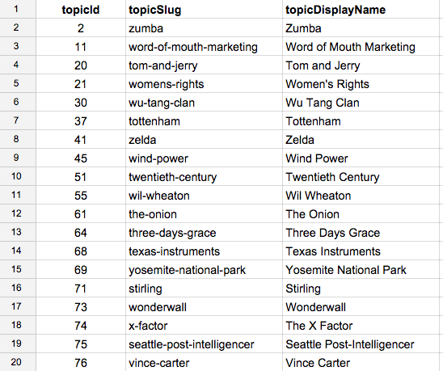

### Usage ###
The following datasets are licensed under a [Creative Commons Attribution 3.0 Unported License](http://creativecommons.org/licenses/by/3.0/).

### Download ###

[Klout Topic Ontology - 2015-07-08](dataset/klout_topic_ontology_20150708.csv) 

### File Format ###

The data is encoded as UTF-8 text in comma-separated format. The columns in the dataset are defined as:

* topicId (signed int64)
* topicSlug (string)
* topicDisplayName (string)

### Example ###

[](images/klout_topic_ontology.png)

### Citing ###

If you use the dataset, please cite:
```
Klout, 
Klout Topic Ontology, 
https://github.com/opendata, 
07 08, 2015
```

BibTex:
```
@inproceedings{klout:topic_ontology,
 author = {Klout,
 title = {Klout Topic Ontology},
 howpublished = "\url{https://github.com/klout/opendata}",
 edition = "02 23, 2015"
}
```
