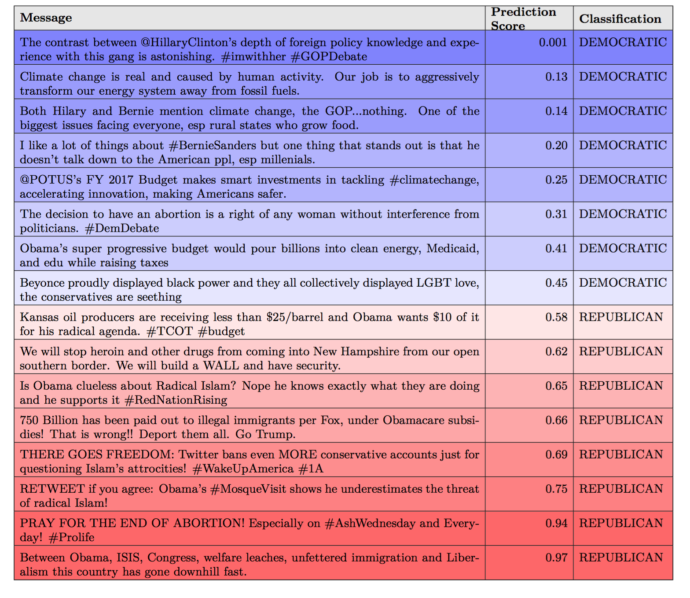

### Data Sets ###

### Paper ### 


Paper avaiavle [here](https://arxiv.org/pdf/1607.02501.pdf).

```
@inproceedings{DBLP:conf/kdd/Rao16,
  author    = {Adithya Rao and Nemanja Spasojevic},
  title     = {Actionable and Political Text Classification using Word Embeddings and LSTM},
  booktitle = {Proceedings of the Fifth International Workshop on Issues of Sentiment
               Discovery and Opinion Mining, {WISDOM} 2016, San Francisco, CA, USA, August
               14, 2016},
  year      = {2016},
  crossref  = {DBLP:conf/kdd/2016wisdom}
}
```

### Twitter User List By Political Leaning  ###

As part of our research on classifying political leaning from tweets, we run experiments on users that were listed on [Twitter Lists](https://dev.twitter.com/rest/reference/get/lists/list) as **Democrat** or **Republican**. We identify users as follows: 
   - **DEMOCRAT** - is a user on a list having 'democrat', 'democratic party', or 'democrats' in it's title 
   - **REPUBLICAN** - is a user on a list having 'republican', 'republican party', or'republicans' in it's title
   
This list includes 27,130 users, with roughly equal number of **Democrat** and **Republican** users. The list file contains the Twitter username and the political leaning for each user. The tab-separated file can be downloaded [here](https://github.com/klout/opendata/blob/master/political_leaning/twitter_users_by_political_leaning.tsv). 

The tweets of these users sampled over a period of 3 months between Oct 12th 2015 and Jan 12th 2016 is used for our experiments.


### Models ###

Messages sampled from the dataset described above were used to train models. The model that gave the highest accuracy is available for download, along with the network architecture and the tokenizer used. This model was trained using the "Adam" optimizer with sigmoid activation. The following hyperparameters were used for training:
   
   - Training set samples : 336,000
   - Test Set samples : 84,000
   - Vocabulary Size : 20,000
   - Max input length (tokens) : 50 
   - Embedding Layer Units : 128
   - LSTM Layer Units : 32
   - Dropout fraction : 0.5

The model was trained for 2 epochs, which was sufficient for convergence. Training for epochs greater than 2 led to overfitting. 

The final accuracy values were as below:

   - Training set accuracy : **88.82 %**
   - Test set accuracy : **87.57 %** 

Some examples of the predictions made by the model are shown below:


   
The encrypted zip file with the model weights, tokenizer and network architecture is available [here](https://github.com/klout/opendata/blob/master/political_leaning/democrats_vs_republicans_model.zip). Password to access the encrypted zip file is 'team-relevance-2016' (with no quotes).


### New Updated Model Update 2016.09.27 ###
New model avaiable here
[here](https://github.com/klout/opendata/blob/master/political_leaning/democrat_republican_by_list_20160816_1M_sample_open_data.tar.gz)
together with code to run line by line prediction. Data set was generated on month worth of data looking back starting 2016/08/16, with model accuracy of ~90% on the sample data. To run example extract the archive and run command run. Example:

```
tar xvfz democrat_republican_by_list_20160816_1M_sample_open_data.tar.gz
cd democrat_republican_by_list_20160816_1M_sample_open_data
./run # assumes one is using theano  
```
### Update Full Model List 2016.09.27 ###

Table with models avaiable:

  Model                    |      Date         |  Note | Training Set Size | Accuracy | Download
-------------------------- | ----------------- | ----- | ----------------- |--------- | ---------
20160816_1M_sample         | 20160716-20160816 |       | 0.906 | 1,000,000 | [download](https://github.com/klout/opendata/blob/master/political_leaning/democrat_republican_by_list_20160816_1M_sample_open_data.tar.gz) 
20160928_1M_sample         | 20160928-20160928 |       | 0.90125 |   1,000,000 | [download](https://github.com/klout/opendata/blob/master/political_leaning/democrat_republican_by_list_20160928_1M_sample.tar.gz)  
20160928_750k_no_mention   | 20160928-20160928 |  Tweets with no mentions only.| 0.71831 | 750,000 | [download](https://github.com/klout/opendata/blob/master/political_leaning/democrat_republican_by_list_20160928_750k_no_mention.tar.gz)  


```
# pips used
sudo pip install flask==0.11
sudo pip install cherrypy==8.1.0
sudo pip install numpy==1.11
sudo pip install scipy==0.17.1
sudo pip install h5py==2.6.0
sudo pip install theano==0.8.2
sudo pip install keras==1.0.4
sudo pip install datadog==0.13.0
sudo pip install healthcheck==1.3.1

```
