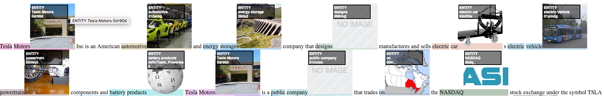

# DAWT: Densely Annotated Wikipedia Texts across multiple languages #

## Usage ##

The following datasets are licensed under a [Attribution-ShareAlike 3.0 Unported](https://creativecommons.org/licenses/by-nc-sa/4.0/)
same as [Wikipedia Database Dumps](https://dumps.wikimedia.org/).


Files with gpg extensions are encrypted, to obtain obtain the key please:
  * Send an email to **team-relevance@klout.com**.
  * Let us know what academic institution you are affiliated with.
  * Briefly describe what and how you are planning to use the data.

Example of how to decrypt file is [down below](https://github.com/klout/opendata/tree/master/wiki_annotation#decript-gpg-file).

## Data Sets ##

In this work, we open up the DAWT dataset - Densely Annotated Wikipedia Texts across multiple languages. The annotations include labeled text mentions mapping to entities (represented by their Freebase machine ids) as well as the type of the entity. The data set contains total of 13.6M articles, 5.0B tokens, 13.8M mention entity co-occurrences. DAWT contains 4.8 times more anchor text to entity links than originally present in the Wikipedia markup. Moreover, it spans several languages including English, Spanish, Italian, German, French and Arabic. In addition to the main dataset, we open up several derived datasets including mention entity co-occurrence counts and entity word2vec, as well as mappings between Freebase ids and Wikidata item ids. We hope that opening them up would prove useful for the Natural Language Processing and Information Retrieval communities, as well as facilitate multi-lingual re- search.


### DAWT : Densely Annotated Wikipedia Annotations ###
__Format:__ new line separated JSON representing document annotations. Example of JSON below table.<br/>
__Example:__ [Single Line 'Iran' wiki enry](https://github.com/klout/opendata/blob/master/wiki_annotation/wiki_annotations_json_sample_single_record_en), [100 wiki pages](https://github.com/klout/opendata/blob/master/wiki_annotation/wiki_annotations_json_sample_en), [formated example below](https://github.com/klout/opendata/blob/master/wiki_annotation/README.md#example-of-single-document-json). 

| Language  | **Version #**  | **Doc #**  | **Sample** | **Full** |
|:----------|---:|-----------:|-----------:|---------:|
| **en**    | v1 | 5,303,722  |    [725kb tar.gz ](http://opendata.klout.com/wiki/wiki_annotation/v1/wiki_annotations_json_sample_en.tar.gz)   | [1/4](http://opendata.klout.com/wiki/wiki_annotation/v1/wiki_annotations_json_en_part_00.tar.gz.gpg), [2/4](http://opendata.klout.com/wiki/wiki_annotation/v1/wiki_annotations_json_en_part_01.tar.gz.gpg), [3/4](http://opendata.klout.com/wiki/wiki_annotation/v1/wiki_annotations_json_en_part_02.tar.gz.gpg), [4/4](http://opendata.klout.com/wiki/wiki_annotation/v1/wiki_annotations_json_en_part_03.tar.gz.gpg) tar.gz.gpg  |
| **es**    | v1 | 2,393,366 |    [373kb tar.gz ](http://opendata.klout.com/wiki/wiki_annotation/v1/wiki_annotations_json_sample_es.tar.gz.gpg)   | [2.1GB tar.gz.gpg ](http://opendata.klout.com/wiki/wiki_annotation/v1/wiki_annotations_json_es.tar.gz)   |
| **it**    | v1 | 1,467,486  |    [332KB tar.gz ](http://opendata.klout.com/wiki/wiki_annotation/v1/wiki_annotations_json_sample_it.tar.gz.gpg)   | [1.6GB tar.gz.gpg ](http://opendata.klout.com/wiki/wiki_annotation/v1/wiki_annotations_json_it.tar.gz)   |
| **fr**    | v1 | 1,750,536  |    [429KB tar.gz ](http://opendata.klout.com/wiki/wiki_annotation/v1/wiki_annotations_json_sample_fr.tar.gz.gpg)   | [2.8GB tar.gz.gpg ](http://opendata.klout.com/wiki/wiki_annotation/v1/wiki_annotations_json_fr.tar.gz)   |
| **de**    | v1 | 1,818,649  |    [454KB tar.gz ](http://opendata.klout.com/wiki/wiki_annotation/v1/wiki_annotations_json_sample_de.tar.gz.gpg)   | [3.7GB tar.gz.gpg ](http://opendata.klout.com/wiki/wiki_annotation/v1/wiki_annotations_json_de.tar.gz)   |
| **ar**    | v1 | 889,007  |    [297KB tar.gz ](http://opendata.klout.com/wiki/wiki_annotation/v1/wiki_annotations_json_sample_ar.tar.gz.gpg)   | [482MB tar.gz.gpg ](http://opendata.klout.com/wiki/wiki_annotation/v1/wiki_annotations_json_ar.tar.gz.gpg)   |


### Mention Entity Cooccurance ###

__Format:__ ```<entity_id>	<mention>	<total_count> <total_unique_doc_count>``` - new lines separated by '\n' fields '\t' separated.<br/>
__Example:__ [English Sample Set](https://github.com/klout/opendata/blob/master/wiki_annotation/entity_mention_cooccurrences_sample_en.tsv)

| Language  | **Version #**  | **Pair #**  | **Sample** | **Full** |
|:----------|---:|-----------:|-----------:|---------:|
| **en**    | v1 | 6,956,439  |    [tar.gz](http://opendata.klout.com/wiki/entity_mention/v1/entity_mention_cooccurrences_sample_en.tar.gz)   | [295MB tar.gz.gpg](http://opendata.klout.com/wiki/entity_mention/v1/entity_mention_cooccurrences_en.tar.gz.gpg)   |
| **es**    | v1 | 1,038,284  |    [tar.gz](http://opendata.klout.com/wiki/entity_mention/v1/entity_mention_cooccurrences_sample_es.tar.gz)   | [72MB tar.gz.gpg](http://opendata.klout.com/wiki/entity_mention/v1/entity_mention_cooccurrences_es.tar.gz.gpg)   |
| **it**    | v1 | 931,369  |    [tar.gz](http://opendata.klout.com/wiki/entity_mention/v1/entity_mention_cooccurrences_sample_it.tar.gz)   | [63MB tar.gz.gpg](http://opendata.klout.com/wiki/entity_mention/v1/entity_mention_cooccurrences_it.tar.gz.gpg)   |
| **fr**    | v1 | 1,952,818  |    [tar.gz](http://opendata.klout.com/wiki/entity_mention/v1/entity_mention_cooccurrences_sample_fr.tar.gz)   | [94MB tar.gz.gpg](http://opendata.klout.com/wiki/entity_mention/v1/entity_mention_cooccurrences_fr.tar.gz.gpg)   |
| **de**    | v1 | 2,438,583  |    [tar.gz](http://opendata.klout.com/wiki/entity_mention/v1/entity_mention_cooccurrences_sample_de.tar.gz)   | [110MB tar.gz.gpg](http://opendata.klout.com/wiki/entity_mention/v1/entity_mention_cooccurrences_de.tar.gz.gpg)   |
| **ar**    | v1 | 433,472  |    [tar.gz](http://opendata.klout.com/wiki/entity_mention/v1/entity_mention_cooccurrences_sample_ar.tar.gz)   | [19MB tar.gz.gpg](http://opendata.klout.com/wiki/entity_mention/v1/entity_mention_cooccurrences_ar.tar.gz.gpg)   |


### Entity Occurrence Counts ###
__Format:__ new lines separated by '\n' fields '\t' separated, fields:```<entity_id>	<total_count> <total_unique_doc_count>```.<br/>
__Example:__ [English Sample Set](https://github.com/klout/opendata/blob/master/wiki_annotation/entity_counts_sample_en.tsv)


| Language  | **Version #**  | **#**  | **Sample** | **Full** |
|:----------|---:|-----------:|-----------:|---------:|
| **en**    | v1 | 1,276,917  |    [tar.gz](http://opendata.klout.com/wiki/entity_mention/v1/entity_counts_sample_en.tar.gz)   | [15.9MB tar.gz.gpg](http://opendata.klout.com/wiki/entity_mention/v1/entity_counts_en.tar.gz.gpg)   |
| **es**    | v1 | 224,695  |    [tar.gz](http://opendata.klout.com/wiki/entity_mention/v1/entity_counts_sample_es.tar.gz)   | [4.7MB tar.gz.gpg](http://opendata.klout.com/wiki/entity_mention/v1/entity_counts_es.tar.gz.gpg)   |
| **it**    | v1 | 211,687  |    [tar.gz](http://opendata.klout.com/wiki/entity_mention/v1/entity_counts_sample_it.tar.gz)   | [4.4MB tar.gz.gpg](http://opendata.klout.com/wiki/entity_mention/v1/entity_counts_it.tar.gz.gpg)   |
| **fr**    | v1 | 423,603  |    [tar.gz](http://opendata.klout.com/wiki/entity_mention/v1/entity_counts_sample_fr.tar.gz)   | [6.3MB tar.gz.gpg](http://opendata.klout.com/wiki/entity_mention/v1/entity_counts_fr.tar.gz.gpg)   |
| **de**    | v1 | 426,556  |    [tar.gz](http://opendata.klout.com/wiki/entity_mention/v1/entity_counts_sample_de.tar.gz)   | [6.6MB tar.gz.gpg](http://opendata.klout.com/wiki/entity_mention/v1/entity_counts_de.tar.gz.gpg)   |
| **ar**    | v1 | 186,787  |    [tar.gz](http://opendata.klout.com/wiki/entity_mention/v1/entity_counts_sample_ar.tar.gz)   | [1.6MB tar.gz.gpg](http://opendata.klout.com/wiki/entity_mention/v1/entity_counts_ar.tar.gz.gpg)   |


### Mention Occurrence Counts ###
__Format:__ ```<mention>	<total_count> <total_unique_doc_count>``` - new lines separated by '\n' fields '\t' separated.<br/>
__Example:__ [English Sample Set](https://github.com/klout/opendata/blob/master/wiki_annotation/mention_counts_sample_en.tsv)

| Language  | **Version #**  | **#**  | **Sample** | **Full** |
|:----------|---:|-----------:|-----------:|---------:|
| **en**    | v1 | 5,786,727  |    [tar.gz](http://opendata.klout.com/wiki/entity_mention/v1/mention_counts_sample_en.tar.gz)   | [15.9MB tar.gz.gpg](http://opendata.klout.com/wiki/entity_mention/v1/mention_counts_en.tar.gz.gpg)   |
| **es**    | v1 | 901,370  |    [tar.gz](http://opendata.klout.com/wiki/entity_mention/v1/mention_counts_sample_es.tar.gz)   | [155MB tar.gz.gpg](http://opendata.klout.com/wiki/entity_mention/v1/mention_counts_es.tar.gz.gpg)   |
| **it**    | v1 | 799,988  |    [tar.gz](http://opendata.klout.com/wiki/entity_mention/v1/mention_counts_sample_it.tar.gz)   | [43MB tar.gz.gpg](http://opendata.klout.com/wiki/entity_mention/v1/mention_counts_it.tar.gz.gpg)   |
| **fr**    | v1 | 1,670,491  |    [tar.gz](http://opendata.klout.com/wiki/entity_mention/v1/mention_counts_sample_fr.tar.gz)   | [38MB tar.gz.gpg](http://opendata.klout.com/wiki/entity_mention/v1/mention_counts_fr.tar.gz.gpg)   |
| **de**    | v1 | 2,168,723  |    [tar.gz](http://opendata.klout.com/wiki/entity_mention/v1/mention_counts_sample_de.tar.gz)   | [63MB tar.gz.gpg](http://opendata.klout.com/wiki/entity_mention/v1/mention_counts_de.tar.gz.gpg)   |
| **ar**    | v1 | 394,024  |    [tar.gz](http://opendata.klout.com/wiki/entity_mention/v1/mention_counts_sample_ar.tar.gz)   | [11MB tar.gz.gpg](http://opendata.klout.com/wiki/entity_mention/v1/mention_counts_ar.tar.gz.gpg)   |


### Word2Vec - [GloVe](http://nlp.stanford.edu/projects/glove/) ###
__Format:__```<entity_id> <val_1> <val_2> ... <val_N>``` - new lines separated by '\n' fields space (' ') separated.<br/>

| Vector Size  | **Version #**  | **Entity #**  | **Full** |
|:----------|---:|-----------:|-----------:|
| **50**    | v1 | 1,612,117  | [316MB tar.gz](http://opendata.klout.com/wiki/word2vec/v1/wiki_entity_all_50_vectors.tar.gz)   | 
| **300**   | v1 | 1,612,117  | [1.7GB tar.gz](http://opendata.klout.com/wiki/word2vec/v1/wiki_entity_all_300_vectors.tar.gz)   | 
| **1000**  | v1 | 1,612,117  | [1.9GB tar.gz 1/3](http://opendata.klout.com/wiki/word2vec/v1/wiki_entity_all_1000_vector_part_1.tar.gz), [1.8GB tar.gz 2/3](http://opendata.klout.com/wiki/word2vec/v1/wiki_entity_all_1000_vector_part_1.tar.gz), [1.6GB tar.gz 3/3](http://opendata.klout.com/wiki/word2vec/v1/wiki_entity_all_1000_vector_part_1.tar.gz)   | 


### Freebase Id to WikiData Item Id
__Format:__```<entity_id> <wiki_data_item_id>``` - new lines separated by '\n' fields space (' ') separated.<br/>

| **Version #**  | **Entity #**  | **Sample** | **Full** |
|---|-----------:|-----------:|---------:|
| v1 | 4,432,449 | [1.6K txt](https://github.com/klout/opendata/blob/master/wiki_annotation/freebase_id_wikidata_item_id_sample.txt) | [30MB tar.gz](http://opendata.klout.com/wiki/freebase_wikidata_mappings/v1/freebase_id_wikidata_item_id.tar.gz)

### Freebase Id to Wiki Page
__Format:__```<entity_id> <wiki_url>``` - new lines separated by '\n' fields space (' ') separated.<br/>

| Language  | **Version #**  | **Entity #**  | **Full** |
|:----------|---:|-----------:|---------:|
| **en**    | v1 | 4,316,959  | [67MB tar.gz](http://opendata.klout.com/wiki/freebase_wikidata_mappings/v1/freebase_id_wiki_url.en.tar.gz) |
| **es**    | v1 | 775,792 | [12MB tar.gz](http://opendata.klout.com/wiki/freebase_wikidata_mappings/v1/freebase_id_wiki_url.es.tar.gz) |
| **it**    | v1 | 814,213  | [13MB tar.gz](http://opendata.klout.com/wiki/freebase_wikidata_mappings/v1/freebase_id_wiki_url.it.tar.gz) |
| **fr**    | v1 | 1,056,601 | [17MB tar.gz](http://opendata.klout.com/wiki/freebase_wikidata_mappings/v1/freebase_id_wiki_url.fr.tar.gz) |
| **de**    | v1 | 896,152 | [14MB tar.gz ](http://opendata.klout.com/wiki/freebase_wikidata_mappings/v1/freebase_id_wiki_url.de.tar.gz) |
| **ar**    | v1 | 284,001 | [4MB tar.gz ](http://opendata.klout.com/wiki/freebase_wikidata_mappings/v1/freebase_id_wiki_url.ar.tar.gz) |

[English Samples, 5.9K](https://github.com/klout/opendata/blob/master/wiki_annotation/freebase_id_wiki_url.en.sample.txt)


### Decript GPG File ###

```
# Decript File (assuming key locally abaiable in v1.gpg_key)
gpg --cipher-algo AES256 --passphrase $(cat v1.gpg_key) --output wiki_annotations_sample_es_json.tar.gz --decrypt wiki_annotations_sample_es_json.tar.gz.gpg

# Uncompress File. 
tar xvfz wiki_annotations_sample_es_json.tar.gz
```

### Citing ###


If you use the dataset, please cite:
```
Nemanja Spasojevic, Preeti Bhargava and Guoning Hu
DAWT: Densely Annotated Wikipedia Texts across multiple languages
In Submission ...
```

BibTex:
```
@inproceedings{Spasojevic:dawt,
 author = {Nemanja Spasojevic, Preeti Bhargava and Guoning Hu},
 title = {DAWT: Densely Annotated Wikipedia Texts across multiple languages},
 booktitle = {In Submission},
 series = {...},
 year = {2017}
}
```

## Appendix ##

#### Example of single document JSON ####
```
{
	"tokens": [{
		"raw_form": "Vlade"
	}, {
		"raw_form": "Divac"
	}, {
		"raw_form": "is"
	}, {
		"raw_form": "a"
	}, {
		"raw_form": "retired"
	}, {
		"raw_form": "Serbian"
	}, {
		"raw_form": "NBA"
	}, {
		"raw_form": "player",
		"break": "SENTENCE"
	}],
	"entities": [{
		"id_str": "01vpr3",
		"type": "PERSON",
		"start_position": 0,
		"end_position": 1,
		"raw_form": "Vlade Divac"
	}, {
		"id_str": "077qn",
		"type": "LOCATION",
		"start_position": 5,
		"end_position": 5,
		"raw_form": "Serbian"
	}, {
		"id_str": "05jvx",
		"type": "ORGANIZATION",
		"start_position": 6,
		"end_position": 6,
		"raw_form": "NBA"
	}],
	"id": "wiki_page_id:en:322505:01vpr3:Vlade_Divac"
}
```



