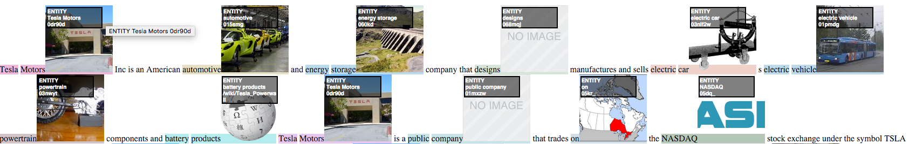

# DAWT: Densely Annotated Wikipedia Texts across multiple languages #

## Usage ##

The following datasets are licensed under a [Attribution-ShareAlike 3.0 Unported](https://creativecommons.org/licenses/by-nc-sa/4.0/)
same as [Wikipedia Database Dumps](https://dumps.wikimedia.org/).


Files with gpg extensions are encrypted, to obtain obtain the key please:
  * Send an email to **team-relevance@klout.com**.
  * Let us know what academic institution you are affiliated with.
  * Briefly describe what and how you are planning to use the data.

Example of how to decrypt file is [down below](https://github.com/klout/opendata/tree/master/wiki_annotation#decript-gpg-file).

## Data Sets ##

In [this work](https://arxiv.org/pdf/1703.00948.pdf), we open up the DAWT dataset - Densely Annotated Wikipedia Texts across multiple languages. The annotations include labeled text mentions mapping to entities (represented by their Freebase machine ids) as well as the type of the entity. The data set contains total of 13.6M articles, 5.0B tokens, 13.8M mention entity co-occurrences. DAWT contains 4.8 times more anchor text to entity links than originally present in the Wikipedia markup. Moreover, it spans several languages including English, Spanish, Italian, German, French and Arabic. In addition to the main dataset, we open up several derived datasets including mention entity co-occurrence counts and entity word2vec, as well as mappings between Freebase ids and Wikidata item ids. We hope that opening them up would prove useful for the Natural Language Processing and Information Retrieval communities, as well as facilitate multi-lingual re- search.


### DAWT : Densely Annotated Wikipedia Annotations ###
__Format:__ new line separated JSON representing document annotations. Example of JSON below table.<br/>
__Example:__ [Single Line 'Iran' wiki enry](https://github.com/klout/opendata/blob/master/wiki_annotation/wiki_annotations_json_sample_single_record_en), [100 wiki pages](https://github.com/klout/opendata/blob/master/wiki_annotation/wiki_annotations_json_sample_en), [formated example below](https://github.com/klout/opendata/blob/master/wiki_annotation/README.md#example-of-single-document-json). 

| Language  | **Version #**  | **Doc #**  | **Sample** | **Full** |
|:----------|---:|-----------:|-----------:|---------:|
| **en**    | v2 | 5,247,345 |    [5.1M tar.gz](http://opendata.klout.com/wiki/wiki_annotation/v2/wiki_annotations_json_sample_en.tar.gz)   | [79G tar.gz.gpg](http://opendata.klout.com/wiki/wiki_annotation/v2/wiki_annotations_json_en.tar.gz.gpg)   |
| **sv**    | v2 | 3,770,296 |    [2.9M tar.gz](http://opendata.klout.com/wiki/wiki_annotation/v2/wiki_annotations_json_sample_sv.tar.gz)   | [19G tar.gz.gpg](http://opendata.klout.com/wiki/wiki_annotation/v2/wiki_annotations_json_sv.tar.gz.gpg)   |
| **nl**    | v2 | 1,825,830 |    [2.9M tar.gz](http://opendata.klout.com/wiki/wiki_annotation/v2/wiki_annotations_json_sample_nl.tar.gz)   | [11G tar.gz.gpg](http://opendata.klout.com/wiki/wiki_annotation/v2/wiki_annotations_json_nl.tar.gz.gpg)   |
| **de**    | v2 | 1,817,719 |    [3.5M tar.gz](http://opendata.klout.com/wiki/wiki_annotation/v2/wiki_annotations_json_sample_de.tar.gz)   | [31G tar.gz.gpg](http://opendata.klout.com/wiki/wiki_annotation/v2/wiki_annotations_json_de.tar.gz.gpg)   |
| **fr**    | v2 | 1,784,505 |    [3.8M tar.gz](http://opendata.klout.com/wiki/wiki_annotation/v2/wiki_annotations_json_sample_fr.tar.gz)   | [26G tar.gz.gpg](http://opendata.klout.com/wiki/wiki_annotation/v2/wiki_annotations_json_fr.tar.gz.gpg)   |
| **ru**    | v2 | 1,377,029 |    [4.4M tar.gz](http://opendata.klout.com/wiki/wiki_annotation/v2/wiki_annotations_json_sample_ru.tar.gz)   | [23G tar.gz.gpg](http://opendata.klout.com/wiki/wiki_annotation/v2/wiki_annotations_json_ru.tar.gz.gpg)   |
| **it**    | v2 | 1,268,911 |    [3.6M tar.gz](http://opendata.klout.com/wiki/wiki_annotation/v2/wiki_annotations_json_sample_it.tar.gz)   | [16G tar.gz.gpg](http://opendata.klout.com/wiki/wiki_annotation/v2/wiki_annotations_json_it.tar.gz.gpg)   |
| **es**    | v2 | 1,242,593 |    [3.9M tar.gz](http://opendata.klout.com/wiki/wiki_annotation/v2/wiki_annotations_json_sample_es.tar.gz)   | [19G tar.gz.gpg](http://opendata.klout.com/wiki/wiki_annotation/v2/wiki_annotations_json_es.tar.gz.gpg)   |
| **pl**    | v2 | 1,159,914 |    [2.9M tar.gz](http://opendata.klout.com/wiki/wiki_annotation/v2/wiki_annotations_json_sample_pl.tar.gz)   | [12G tar.gz.gpg](http://opendata.klout.com/wiki/wiki_annotation/v2/wiki_annotations_json_pl.tar.gz.gpg)   |
| **vi**    | v2 | 1,150,719 |    [2.7M tar.gz](http://opendata.klout.com/wiki/wiki_annotation/v2/wiki_annotations_json_sample_vi.tar.gz)   | [5.0G tar.gz.gpg](http://opendata.klout.com/wiki/wiki_annotation/v2/wiki_annotations_json_vi.tar.gz.gpg)   |
| **ja**    | v2 | 1,058,856 |    [3.8M tar.gz](http://opendata.klout.com/wiki/wiki_annotation/v2/wiki_annotations_json_sample_ja.tar.gz)   | [27G tar.gz.gpg](http://opendata.klout.com/wiki/wiki_annotation/v2/wiki_annotations_json_ja.tar.gz.gpg)   |
| **pt**    | v2 | 951,814 |    [3.5M tar.gz](http://opendata.klout.com/wiki/wiki_annotation/v2/wiki_annotations_json_sample_pt.tar.gz)   | [9.6G tar.gz.gpg](http://opendata.klout.com/wiki/wiki_annotation/v2/wiki_annotations_json_pt.tar.gz.gpg)   |
| **zh**    | v2 | 915,493 |    [0 tar.gz](http://opendata.klout.com/wiki/wiki_annotation/v2/wiki_annotations_json_sample_zh.tar.gz)   | [6.0G tar.gz.gpg](http://opendata.klout.com/wiki/wiki_annotation/v2/wiki_annotations_json_zh.tar.gz.gpg)   |
| **uk**    | v2 | 656,178 |    [3.5M tar.gz](http://opendata.klout.com/wiki/wiki_annotation/v2/wiki_annotations_json_sample_uk.tar.gz)   | [8.5G tar.gz.gpg](http://opendata.klout.com/wiki/wiki_annotation/v2/wiki_annotations_json_uk.tar.gz.gpg)   |
| **ar**    | v2 | 585,895 |    [2.9M tar.gz](http://opendata.klout.com/wiki/wiki_annotation/v2/wiki_annotations_json_sample_ar.tar.gz)   | [4.5G tar.gz.gpg](http://opendata.klout.com/wiki/wiki_annotation/v2/wiki_annotations_json_ar.tar.gz.gpg)   |
| **ca**    | v2 | 537,317 |    [2.7M tar.gz](http://opendata.klout.com/wiki/wiki_annotation/v2/wiki_annotations_json_sample_ca.tar.gz)   | [6.7G tar.gz.gpg](http://opendata.klout.com/wiki/wiki_annotation/v2/wiki_annotations_json_ca.tar.gz.gpg)   |
| **fa**    | v2 | 531,221 |    [2.8M tar.gz](http://opendata.klout.com/wiki/wiki_annotation/v2/wiki_annotations_json_sample_fa.tar.gz)   | [3.9G tar.gz.gpg](http://opendata.klout.com/wiki/wiki_annotation/v2/wiki_annotations_json_fa.tar.gz.gpg)   |
| **tr**    | v2 | 497,522 |    [2.2M tar.gz](http://opendata.klout.com/wiki/wiki_annotation/v2/wiki_annotations_json_sample_tr.tar.gz)   | [2.6G tar.gz.gpg](http://opendata.klout.com/wiki/wiki_annotation/v2/wiki_annotations_json_tr.tar.gz.gpg)   |
| **no**    | v2 | 458,887 |    [2.3M tar.gz](http://opendata.klout.com/wiki/wiki_annotation/v2/wiki_annotations_json_sample_no.tar.gz)   | [4.1G tar.gz.gpg](http://opendata.klout.com/wiki/wiki_annotation/v2/wiki_annotations_json_no.tar.gz.gpg)   |
| **sh**    | v2 | 419,893 |    [2.0M tar.gz](http://opendata.klout.com/wiki/wiki_annotation/v2/wiki_annotations_json_sample_sh.tar.gz)   | [2.7G tar.gz.gpg](http://opendata.klout.com/wiki/wiki_annotation/v2/wiki_annotations_json_sh.tar.gz.gpg)   |
| **hu**    | v2 | 409,439 |    [2.5M tar.gz](http://opendata.klout.com/wiki/wiki_annotation/v2/wiki_annotations_json_sample_hu.tar.gz)   | [4.3G tar.gz.gpg](http://opendata.klout.com/wiki/wiki_annotation/v2/wiki_annotations_json_hu.tar.gz.gpg)   |
| **fi**    | v2 | 399,208 |    [2.5M tar.gz](http://opendata.klout.com/wiki/wiki_annotation/v2/wiki_annotations_json_sample_fi.tar.gz)   | [3.6G tar.gz.gpg](http://opendata.klout.com/wiki/wiki_annotation/v2/wiki_annotations_json_fi.tar.gz.gpg)   |
| **id**    | v2 | 397,083 |    [2.5M tar.gz](http://opendata.klout.com/wiki/wiki_annotation/v2/wiki_annotations_json_sample_id.tar.gz)   | [3.0G tar.gz.gpg](http://opendata.klout.com/wiki/wiki_annotation/v2/wiki_annotations_json_id.tar.gz.gpg)   |
| **ko**    | v2 | 380,101 |    [2.4M tar.gz](http://opendata.klout.com/wiki/wiki_annotation/v2/wiki_annotations_json_sample_ko.tar.gz)   | [3.2G tar.gz.gpg](http://opendata.klout.com/wiki/wiki_annotation/v2/wiki_annotations_json_ko.tar.gz.gpg)   |
| **sr**    | v2 | 375,912 |    [2.3M tar.gz](http://opendata.klout.com/wiki/wiki_annotation/v2/wiki_annotations_json_sample_sr.tar.gz)   | [3.2G tar.gz.gpg](http://opendata.klout.com/wiki/wiki_annotation/v2/wiki_annotations_json_sr.tar.gz.gpg)   |
| **cs**    | v2 | 369,678 |    [2.8M tar.gz](http://opendata.klout.com/wiki/wiki_annotation/v2/wiki_annotations_json_sample_cs.tar.gz)   | [5.0G tar.gz.gpg](http://opendata.klout.com/wiki/wiki_annotation/v2/wiki_annotations_json_cs.tar.gz.gpg)   |
| **bg**    | v2 | 221,425 |    [2.5M tar.gz](http://opendata.klout.com/wiki/wiki_annotation/v2/wiki_annotations_json_sample_bg.tar.gz)   | [2.7G tar.gz.gpg](http://opendata.klout.com/wiki/wiki_annotation/v2/wiki_annotations_json_bg.tar.gz.gpg)   |
| **hy**    | v2 | 219,636 |    [1.7M tar.gz](http://opendata.klout.com/wiki/wiki_annotation/v2/wiki_annotations_json_sample_hy.tar.gz)   | [1.8G tar.gz.gpg](http://opendata.klout.com/wiki/wiki_annotation/v2/wiki_annotations_json_hy.tar.gz.gpg)   |
| **sk**    | v2 | 217,628 |    [1.6M tar.gz](http://opendata.klout.com/wiki/wiki_annotation/v2/wiki_annotations_json_sample_sk.tar.gz)   | [1.5G tar.gz.gpg](http://opendata.klout.com/wiki/wiki_annotation/v2/wiki_annotations_json_sk.tar.gz.gpg)   |
| **he**    | v2 | 205,494 |    [3.7M tar.gz](http://opendata.klout.com/wiki/wiki_annotation/v2/wiki_annotations_json_sample_he.tar.gz)   | [4.3G tar.gz.gpg](http://opendata.klout.com/wiki/wiki_annotation/v2/wiki_annotations_json_he.tar.gz.gpg)   |
| **hr**    | v2 | 158,855 |    [1.9M tar.gz](http://opendata.klout.com/wiki/wiki_annotation/v2/wiki_annotations_json_sample_hr.tar.gz)   | [1.6G tar.gz.gpg](http://opendata.klout.com/wiki/wiki_annotation/v2/wiki_annotations_json_hr.tar.gz.gpg)   |
| **sl**    | v2 | 150,058 |    [1.6M tar.gz](http://opendata.klout.com/wiki/wiki_annotation/v2/wiki_annotations_json_sample_sl.tar.gz)   | [1.4G tar.gz.gpg](http://opendata.klout.com/wiki/wiki_annotation/v2/wiki_annotations_json_sl.tar.gz.gpg)   |
| **be**    | v2 | 143,032 |    [1.3M tar.gz](http://opendata.klout.com/wiki/wiki_annotation/v2/wiki_annotations_json_sample_be.tar.gz)   | [1.2G tar.gz.gpg](http://opendata.klout.com/wiki/wiki_annotation/v2/wiki_annotations_json_be.tar.gz.gpg)   |
| **gl**    | v2 | 138,910 |    [1.9M tar.gz](http://opendata.klout.com/wiki/wiki_annotation/v2/wiki_annotations_json_sample_gl.tar.gz)   | [1.5G tar.gz.gpg](http://opendata.klout.com/wiki/wiki_annotation/v2/wiki_annotations_json_gl.tar.gz.gpg)   |
| **el**    | v2 | 130,425 |    [2.3M tar.gz](http://opendata.klout.com/wiki/wiki_annotation/v2/wiki_annotations_json_sample_el.tar.gz)   | [2.0G tar.gz.gpg](http://opendata.klout.com/wiki/wiki_annotation/v2/wiki_annotations_json_el.tar.gz.gpg)   |
| **ur**    | v2 | 122,407 |    [648K tar.gz](http://opendata.klout.com/wiki/wiki_annotation/v2/wiki_annotations_json_sample_ur.tar.gz)   | [530M tar.gz.gpg](http://opendata.klout.com/wiki/wiki_annotation/v2/wiki_annotations_json_ur.tar.gz.gpg)   |
| **simple**    | v2 | 122,109 |    [0 tar.gz](http://opendata.klout.com/wiki/wiki_annotation/v2/wiki_annotations_json_sample_simple.tar.gz)   | [522M tar.gz.gpg](http://opendata.klout.com/wiki/wiki_annotation/v2/wiki_annotations_json_simple.tar.gz.gpg)   |
| **hi**    | v2 | 121,157 |    [2.1M tar.gz](http://opendata.klout.com/wiki/wiki_annotation/v2/wiki_annotations_json_sample_hi.tar.gz)   | [947M tar.gz.gpg](http://opendata.klout.com/wiki/wiki_annotation/v2/wiki_annotations_json_hi.tar.gz.gpg)   |
| **ka**    | v2 | 115,366 |    [1.4M tar.gz](http://opendata.klout.com/wiki/wiki_annotation/v2/wiki_annotations_json_sample_ka.tar.gz)   | [961M tar.gz.gpg](http://opendata.klout.com/wiki/wiki_annotation/v2/wiki_annotations_json_ka.tar.gz.gpg)   |
| **th**    | v2 | 114,255 |    [2.0M tar.gz](http://opendata.klout.com/wiki/wiki_annotation/v2/wiki_annotations_json_sample_th.tar.gz)   | [1.2G tar.gz.gpg](http://opendata.klout.com/wiki/wiki_annotation/v2/wiki_annotations_json_th.tar.gz.gpg)   |
| **zh_yue**    | v2 | 48,411 |    [0 tar.gz](http://opendata.klout.com/wiki/wiki_annotation/v2/wiki_annotations_json_sample_zh_yue.tar.gz)   | [201M tar.gz.gpg](http://opendata.klout.com/wiki/wiki_annotation/v2/wiki_annotations_json_zh_yue.tar.gz.gpg)   |

### Mention Entity Cooccurance ###

__Format:__ ```<entity_id>	<mention>	<total_count> <total_unique_doc_count>``` - new lines separated by '\n' fields '\t' separated.<br/>
__Example:__ [English Sample Set](https://github.com/klout/opendata/blob/master/wiki_annotation/entity_mention_cooccurrences_sample_en.tsv)

| Language  | **Version #**  | **Pair #**  | **Sample** | **Full** |
|:----------|---:|-----------:|-----------:|---------:|
| **en**    | v2 | 21,260,365 |    [256K tar.gz](http://opendata.klout.com/wiki/entity_mention/v2/entity_mention_cooccurrences_sample_en.tar.gz)   | [636M tar.gz.gpg](http://opendata.klout.com/wiki/entity_mention/v2/entity_mention_cooccurrences_en.tar.gz.gpg)   |
| **sv**    | v2 | 7,141,828 |    [56K tar.gz](http://opendata.klout.com/wiki/entity_mention/v2/entity_mention_cooccurrences_sample_sv.tar.gz)   | [231M tar.gz.gpg](http://opendata.klout.com/wiki/entity_mention/v2/entity_mention_cooccurrences_sv.tar.gz.gpg)   |
| **nl**    | v2 | 5,371,289 |    [64K tar.gz](http://opendata.klout.com/wiki/entity_mention/v2/entity_mention_cooccurrences_sample_nl.tar.gz)   | [148M tar.gz.gpg](http://opendata.klout.com/wiki/entity_mention/v2/entity_mention_cooccurrences_nl.tar.gz.gpg)   |
| **de**    | v2 | 10,409,009 |    [132K tar.gz](http://opendata.klout.com/wiki/entity_mention/v2/entity_mention_cooccurrences_sample_de.tar.gz)   | [298M tar.gz.gpg](http://opendata.klout.com/wiki/entity_mention/v2/entity_mention_cooccurrences_de.tar.gz.gpg)   |
| **fr**    | v2 | 9,114,396 |    [116K tar.gz](http://opendata.klout.com/wiki/entity_mention/v2/entity_mention_cooccurrences_sample_fr.tar.gz)   | [264M tar.gz.gpg](http://opendata.klout.com/wiki/entity_mention/v2/entity_mention_cooccurrences_fr.tar.gz.gpg)   |
| **ru**    | v2 | 9,143,497 |    [216K tar.gz](http://opendata.klout.com/wiki/entity_mention/v2/entity_mention_cooccurrences_sample_ru.tar.gz)   | [387M tar.gz.gpg](http://opendata.klout.com/wiki/entity_mention/v2/entity_mention_cooccurrences_ru.tar.gz.gpg)   |
| **it**    | v2 | 6,111,788 |    [80K tar.gz](http://opendata.klout.com/wiki/entity_mention/v2/entity_mention_cooccurrences_sample_it.tar.gz)   | [171M tar.gz.gpg](http://opendata.klout.com/wiki/entity_mention/v2/entity_mention_cooccurrences_it.tar.gz.gpg)   |
| **es**    | v2 | 7,202,774 |    [120K tar.gz](http://opendata.klout.com/wiki/entity_mention/v2/entity_mention_cooccurrences_sample_es.tar.gz)   | [208M tar.gz.gpg](http://opendata.klout.com/wiki/entity_mention/v2/entity_mention_cooccurrences_es.tar.gz.gpg)   |
| **pl**    | v2 | 5,749,330 |    [88K tar.gz](http://opendata.klout.com/wiki/entity_mention/v2/entity_mention_cooccurrences_sample_pl.tar.gz)   | [165M tar.gz.gpg](http://opendata.klout.com/wiki/entity_mention/v2/entity_mention_cooccurrences_pl.tar.gz.gpg)   |
| **vi**    | v2 | 2,475,869 |    [32K tar.gz](http://opendata.klout.com/wiki/entity_mention/v2/entity_mention_cooccurrences_sample_vi.tar.gz)   | [74M tar.gz.gpg](http://opendata.klout.com/wiki/entity_mention/v2/entity_mention_cooccurrences_vi.tar.gz.gpg)   |
| **ja**    | v2 | 5,751,051 |    [68K tar.gz](http://opendata.klout.com/wiki/entity_mention/v2/entity_mention_cooccurrences_sample_ja.tar.gz)   | [184M tar.gz.gpg](http://opendata.klout.com/wiki/entity_mention/v2/entity_mention_cooccurrences_ja.tar.gz.gpg)   |
| **pt**    | v2 | 4,235,850 |    [92K tar.gz](http://opendata.klout.com/wiki/entity_mention/v2/entity_mention_cooccurrences_sample_pt.tar.gz)   | [121M tar.gz.gpg](http://opendata.klout.com/wiki/entity_mention/v2/entity_mention_cooccurrences_pt.tar.gz.gpg)   |
| **zh**    | v2 | 3,092,080 |    [0 tar.gz](http://opendata.klout.com/wiki/entity_mention/v2/entity_mention_cooccurrences_sample_zh.tar.gz)   | [82M tar.gz.gpg](http://opendata.klout.com/wiki/entity_mention/v2/entity_mention_cooccurrences_zh.tar.gz.gpg)   |
| **uk**    | v2 | 3,759,852 |    [120K tar.gz](http://opendata.klout.com/wiki/entity_mention/v2/entity_mention_cooccurrences_sample_uk.tar.gz)   | [152M tar.gz.gpg](http://opendata.klout.com/wiki/entity_mention/v2/entity_mention_cooccurrences_uk.tar.gz.gpg)   |
| **ar**    | v2 | 1,863,932 |    [72K tar.gz](http://opendata.klout.com/wiki/entity_mention/v2/entity_mention_cooccurrences_sample_ar.tar.gz)   | [69M tar.gz.gpg](http://opendata.klout.com/wiki/entity_mention/v2/entity_mention_cooccurrences_ar.tar.gz.gpg)   |
| **ca**    | v2 | 2,789,964 |    [48K tar.gz](http://opendata.klout.com/wiki/entity_mention/v2/entity_mention_cooccurrences_sample_ca.tar.gz)   | [76M tar.gz.gpg](http://opendata.klout.com/wiki/entity_mention/v2/entity_mention_cooccurrences_ca.tar.gz.gpg)   |
| **fa**    | v2 | 1,582,315 |    [36K tar.gz](http://opendata.klout.com/wiki/entity_mention/v2/entity_mention_cooccurrences_sample_fa.tar.gz)   | [63M tar.gz.gpg](http://opendata.klout.com/wiki/entity_mention/v2/entity_mention_cooccurrences_fa.tar.gz.gpg)   |
| **tr**    | v2 | 1,531,347 |    [24K tar.gz](http://opendata.klout.com/wiki/entity_mention/v2/entity_mention_cooccurrences_sample_tr.tar.gz)   | [43M tar.gz.gpg](http://opendata.klout.com/wiki/entity_mention/v2/entity_mention_cooccurrences_tr.tar.gz.gpg)   |
| **no**    | v2 | 2,210,708 |    [48K tar.gz](http://opendata.klout.com/wiki/entity_mention/v2/entity_mention_cooccurrences_sample_no.tar.gz)   | [60M tar.gz.gpg](http://opendata.klout.com/wiki/entity_mention/v2/entity_mention_cooccurrences_no.tar.gz.gpg)   |
| **sh**    | v2 | 1,405,003 |    [44K tar.gz](http://opendata.klout.com/wiki/entity_mention/v2/entity_mention_cooccurrences_sample_sh.tar.gz)   | [37M tar.gz.gpg](http://opendata.klout.com/wiki/entity_mention/v2/entity_mention_cooccurrences_sh.tar.gz.gpg)   |
| **hu**    | v2 | 2,174,741 |    [60K tar.gz](http://opendata.klout.com/wiki/entity_mention/v2/entity_mention_cooccurrences_sample_hu.tar.gz)   | [59M tar.gz.gpg](http://opendata.klout.com/wiki/entity_mention/v2/entity_mention_cooccurrences_hu.tar.gz.gpg)   |
| **fi**    | v2 | 2,351,158 |    [76K tar.gz](http://opendata.klout.com/wiki/entity_mention/v2/entity_mention_cooccurrences_sample_fi.tar.gz)   | [64M tar.gz.gpg](http://opendata.klout.com/wiki/entity_mention/v2/entity_mention_cooccurrences_fi.tar.gz.gpg)   |
| **id**    | v2 | 1,844,817 |    [32K tar.gz](http://opendata.klout.com/wiki/entity_mention/v2/entity_mention_cooccurrences_sample_id.tar.gz)   | [51M tar.gz.gpg](http://opendata.klout.com/wiki/entity_mention/v2/entity_mention_cooccurrences_id.tar.gz.gpg)   |
| **ko**    | v2 | 1,567,272 |    [24K tar.gz](http://opendata.klout.com/wiki/entity_mention/v2/entity_mention_cooccurrences_sample_ko.tar.gz)   | [46M tar.gz.gpg](http://opendata.klout.com/wiki/entity_mention/v2/entity_mention_cooccurrences_ko.tar.gz.gpg)   |
| **sr**    | v2 | 1,651,959 |    [64K tar.gz](http://opendata.klout.com/wiki/entity_mention/v2/entity_mention_cooccurrences_sample_sr.tar.gz)   | [57M tar.gz.gpg](http://opendata.klout.com/wiki/entity_mention/v2/entity_mention_cooccurrences_sr.tar.gz.gpg)   |
| **cs**    | v2 | 2,856,333 |    [68K tar.gz](http://opendata.klout.com/wiki/entity_mention/v2/entity_mention_cooccurrences_sample_cs.tar.gz)   | [79M tar.gz.gpg](http://opendata.klout.com/wiki/entity_mention/v2/entity_mention_cooccurrences_cs.tar.gz.gpg)   |
| **bg**    | v2 | 1,072,770 |    [44K tar.gz](http://opendata.klout.com/wiki/entity_mention/v2/entity_mention_cooccurrences_sample_bg.tar.gz)   | [41M tar.gz.gpg](http://opendata.klout.com/wiki/entity_mention/v2/entity_mention_cooccurrences_bg.tar.gz.gpg)   |
| **hy**    | v2 | 1,049,789 |    [40K tar.gz](http://opendata.klout.com/wiki/entity_mention/v2/entity_mention_cooccurrences_sample_hy.tar.gz)   | [35M tar.gz.gpg](http://opendata.klout.com/wiki/entity_mention/v2/entity_mention_cooccurrences_hy.tar.gz.gpg)   |
| **sk**    | v2 | 1,184,635 |    [32K tar.gz](http://opendata.klout.com/wiki/entity_mention/v2/entity_mention_cooccurrences_sample_sk.tar.gz)   | [32M tar.gz.gpg](http://opendata.klout.com/wiki/entity_mention/v2/entity_mention_cooccurrences_sk.tar.gz.gpg)   |
| **he**    | v2 | 1,204,496 |    [52K tar.gz](http://opendata.klout.com/wiki/entity_mention/v2/entity_mention_cooccurrences_sample_he.tar.gz)   | [41M tar.gz.gpg](http://opendata.klout.com/wiki/entity_mention/v2/entity_mention_cooccurrences_he.tar.gz.gpg)   |
| **hr**    | v2 | 1,155,336 |    [44K tar.gz](http://opendata.klout.com/wiki/entity_mention/v2/entity_mention_cooccurrences_sample_hr.tar.gz)   | [30M tar.gz.gpg](http://opendata.klout.com/wiki/entity_mention/v2/entity_mention_cooccurrences_hr.tar.gz.gpg)   |
| **sl**    | v2 | 1,148,564 |    [32K tar.gz](http://opendata.klout.com/wiki/entity_mention/v2/entity_mention_cooccurrences_sample_sl.tar.gz)   | [31M tar.gz.gpg](http://opendata.klout.com/wiki/entity_mention/v2/entity_mention_cooccurrences_sl.tar.gz.gpg)   |
| **be**    | v2 | 798,057 |    [36K tar.gz](http://opendata.klout.com/wiki/entity_mention/v2/entity_mention_cooccurrences_sample_be.tar.gz)   | [32M tar.gz.gpg](http://opendata.klout.com/wiki/entity_mention/v2/entity_mention_cooccurrences_be.tar.gz.gpg)   |
| **gl**    | v2 | 903,859 |    [24K tar.gz](http://opendata.klout.com/wiki/entity_mention/v2/entity_mention_cooccurrences_sample_gl.tar.gz)   | [24M tar.gz.gpg](http://opendata.klout.com/wiki/entity_mention/v2/entity_mention_cooccurrences_gl.tar.gz.gpg)   |
| **el**    | v2 | 919,353 |    [52K tar.gz](http://opendata.klout.com/wiki/entity_mention/v2/entity_mention_cooccurrences_sample_el.tar.gz)   | [37M tar.gz.gpg](http://opendata.klout.com/wiki/entity_mention/v2/entity_mention_cooccurrences_el.tar.gz.gpg)   |
| **ur**    | v2 | 331,762 |    [8.0K tar.gz](http://opendata.klout.com/wiki/entity_mention/v2/entity_mention_cooccurrences_sample_ur.tar.gz)   | [12M tar.gz.gpg](http://opendata.klout.com/wiki/entity_mention/v2/entity_mention_cooccurrences_ur.tar.gz.gpg)   |
| **simple**    | v2 | 499,606 |    [0 tar.gz](http://opendata.klout.com/wiki/entity_mention/v2/entity_mention_cooccurrences_sample_simple.tar.gz)   | [14M tar.gz.gpg](http://opendata.klout.com/wiki/entity_mention/v2/entity_mention_cooccurrences_simple.tar.gz.gpg)   |
| **hi**    | v2 | 370,330 |    [24K tar.gz](http://opendata.klout.com/wiki/entity_mention/v2/entity_mention_cooccurrences_sample_hi.tar.gz)   | [18M tar.gz.gpg](http://opendata.klout.com/wiki/entity_mention/v2/entity_mention_cooccurrences_hi.tar.gz.gpg)   |
| **ka**    | v2 | 534,738 |    [40K tar.gz](http://opendata.klout.com/wiki/entity_mention/v2/entity_mention_cooccurrences_sample_ka.tar.gz)   | [27M tar.gz.gpg](http://opendata.klout.com/wiki/entity_mention/v2/entity_mention_cooccurrences_ka.tar.gz.gpg)   |
| **th**    | v2 | 733,115 |    [32K tar.gz](http://opendata.klout.com/wiki/entity_mention/v2/entity_mention_cooccurrences_sample_th.tar.gz)   | [38M tar.gz.gpg](http://opendata.klout.com/wiki/entity_mention/v2/entity_mention_cooccurrences_th.tar.gz.gpg)   |
| **zh_yue**    | v2 | 163,003 |    [0 tar.gz](http://opendata.klout.com/wiki/entity_mention/v2/entity_mention_cooccurrences_sample_zh_yue.tar.gz)   | [3.9M tar.gz.gpg](http://opendata.klout.com/wiki/entity_mention/v2/entity_mention_cooccurrences_zh_yue.tar.gz.gpg)   |

### Entity Occurrence Counts ###
__Format:__ new lines separated by '\n' fields '\t' separated, fields:```<entity_id>	<total_count> <total_unique_doc_count>```.<br/>
__Example:__ [English Sample Set](https://github.com/klout/opendata/blob/master/wiki_annotation/entity_counts_sample_en.tsv)


| Language  | **Version #**  | **#**  | **Sample** | **Full** |
|:----------|---:|-----------:|-----------:|---------:|
| **en**    | v2 | 10,113,186 |    [4.0K tar.gz](http://opendata.klout.com/wiki/entity_mention/v2/entity_counts_sample_en.tar.gz)   | [120M tar.gz.gpg](http://opendata.klout.com/wiki/entity_mention/v2/entity_counts_en.tar.gz.gpg)   |
| **sv**    | v2 | 5,284,112 |    [4.0K tar.gz](http://opendata.klout.com/wiki/entity_mention/v2/entity_counts_sample_sv.tar.gz)   | [64M tar.gz.gpg](http://opendata.klout.com/wiki/entity_mention/v2/entity_counts_sv.tar.gz.gpg)   |
| **nl**    | v2 | 3,167,269 |    [4.0K tar.gz](http://opendata.klout.com/wiki/entity_mention/v2/entity_counts_sample_nl.tar.gz)   | [38M tar.gz.gpg](http://opendata.klout.com/wiki/entity_mention/v2/entity_counts_nl.tar.gz.gpg)   |
| **de**    | v2 | 4,122,809 |    [4.0K tar.gz](http://opendata.klout.com/wiki/entity_mention/v2/entity_counts_sample_de.tar.gz)   | [48M tar.gz.gpg](http://opendata.klout.com/wiki/entity_mention/v2/entity_counts_de.tar.gz.gpg)   |
| **fr**    | v2 | 4,130,026 |    [4.0K tar.gz](http://opendata.klout.com/wiki/entity_mention/v2/entity_counts_sample_fr.tar.gz)   | [48M tar.gz.gpg](http://opendata.klout.com/wiki/entity_mention/v2/entity_counts_fr.tar.gz.gpg)   |
| **ru**    | v2 | 3,329,127 |    [4.0K tar.gz](http://opendata.klout.com/wiki/entity_mention/v2/entity_counts_sample_ru.tar.gz)   | [39M tar.gz.gpg](http://opendata.klout.com/wiki/entity_mention/v2/entity_counts_ru.tar.gz.gpg)   |
| **it**    | v2 | 3,109,548 |    [4.0K tar.gz](http://opendata.klout.com/wiki/entity_mention/v2/entity_counts_sample_it.tar.gz)   | [36M tar.gz.gpg](http://opendata.klout.com/wiki/entity_mention/v2/entity_counts_it.tar.gz.gpg)   |
| **es**    | v2 | 3,486,836 |    [4.0K tar.gz](http://opendata.klout.com/wiki/entity_mention/v2/entity_counts_sample_es.tar.gz)   | [40M tar.gz.gpg](http://opendata.klout.com/wiki/entity_mention/v2/entity_counts_es.tar.gz.gpg)   |
| **pl**    | v2 | 2,479,731 |    [4.0K tar.gz](http://opendata.klout.com/wiki/entity_mention/v2/entity_counts_sample_pl.tar.gz)   | [29M tar.gz.gpg](http://opendata.klout.com/wiki/entity_mention/v2/entity_counts_pl.tar.gz.gpg)   |
| **vi**    | v2 | 1,974,853 |    [4.0K tar.gz](http://opendata.klout.com/wiki/entity_mention/v2/entity_counts_sample_vi.tar.gz)   | [24M tar.gz.gpg](http://opendata.klout.com/wiki/entity_mention/v2/entity_counts_vi.tar.gz.gpg)   |
| **ja**    | v2 | 2,633,482 |    [4.0K tar.gz](http://opendata.klout.com/wiki/entity_mention/v2/entity_counts_sample_ja.tar.gz)   | [31M tar.gz.gpg](http://opendata.klout.com/wiki/entity_mention/v2/entity_counts_ja.tar.gz.gpg)   |
| **pt**    | v2 | 2,288,122 |    [4.0K tar.gz](http://opendata.klout.com/wiki/entity_mention/v2/entity_counts_sample_pt.tar.gz)   | [27M tar.gz.gpg](http://opendata.klout.com/wiki/entity_mention/v2/entity_counts_pt.tar.gz.gpg)   |
| **zh**    | v2 | 2,310,223 |    [0 tar.gz](http://opendata.klout.com/wiki/entity_mention/v2/entity_counts_sample_zh.tar.gz)   | [25M tar.gz.gpg](http://opendata.klout.com/wiki/entity_mention/v2/entity_counts_zh.tar.gz.gpg)   |
| **uk**    | v2 | 1,687,875 |    [4.0K tar.gz](http://opendata.klout.com/wiki/entity_mention/v2/entity_counts_sample_uk.tar.gz)   | [20M tar.gz.gpg](http://opendata.klout.com/wiki/entity_mention/v2/entity_counts_uk.tar.gz.gpg)   |
| **ar**    | v2 | 1,047,861 |    [4.0K tar.gz](http://opendata.klout.com/wiki/entity_mention/v2/entity_counts_sample_ar.tar.gz)   | [12M tar.gz.gpg](http://opendata.klout.com/wiki/entity_mention/v2/entity_counts_ar.tar.gz.gpg)   |
| **ca**    | v2 | 1,526,788 |    [4.0K tar.gz](http://opendata.klout.com/wiki/entity_mention/v2/entity_counts_sample_ca.tar.gz)   | [18M tar.gz.gpg](http://opendata.klout.com/wiki/entity_mention/v2/entity_counts_ca.tar.gz.gpg)   |
| **fa**    | v2 | 1,042,252 |    [4.0K tar.gz](http://opendata.klout.com/wiki/entity_mention/v2/entity_counts_sample_fa.tar.gz)   | [12M tar.gz.gpg](http://opendata.klout.com/wiki/entity_mention/v2/entity_counts_fa.tar.gz.gpg)   |
| **tr**    | v2 | 1,080,763 |    [4.0K tar.gz](http://opendata.klout.com/wiki/entity_mention/v2/entity_counts_sample_tr.tar.gz)   | [12M tar.gz.gpg](http://opendata.klout.com/wiki/entity_mention/v2/entity_counts_tr.tar.gz.gpg)   |
| **no**    | v2 | 1,387,448 |    [4.0K tar.gz](http://opendata.klout.com/wiki/entity_mention/v2/entity_counts_sample_no.tar.gz)   | [16M tar.gz.gpg](http://opendata.klout.com/wiki/entity_mention/v2/entity_counts_no.tar.gz.gpg)   |
| **sh**    | v2 | 754,150 |    [4.0K tar.gz](http://opendata.klout.com/wiki/entity_mention/v2/entity_counts_sample_sh.tar.gz)   | [8.4M tar.gz.gpg](http://opendata.klout.com/wiki/entity_mention/v2/entity_counts_sh.tar.gz.gpg)   |
| **hu**    | v2 | 1,200,261 |    [4.0K tar.gz](http://opendata.klout.com/wiki/entity_mention/v2/entity_counts_sample_hu.tar.gz)   | [14M tar.gz.gpg](http://opendata.klout.com/wiki/entity_mention/v2/entity_counts_hu.tar.gz.gpg)   |
| **fi**    | v2 | 1,038,471 |    [4.0K tar.gz](http://opendata.klout.com/wiki/entity_mention/v2/entity_counts_sample_fi.tar.gz)   | [12M tar.gz.gpg](http://opendata.klout.com/wiki/entity_mention/v2/entity_counts_fi.tar.gz.gpg)   |
| **id**    | v2 | 1,293,216 |    [4.0K tar.gz](http://opendata.klout.com/wiki/entity_mention/v2/entity_counts_sample_id.tar.gz)   | [15M tar.gz.gpg](http://opendata.klout.com/wiki/entity_mention/v2/entity_counts_id.tar.gz.gpg)   |
| **ko**    | v2 | 1,050,889 |    [4.0K tar.gz](http://opendata.klout.com/wiki/entity_mention/v2/entity_counts_sample_ko.tar.gz)   | [12M tar.gz.gpg](http://opendata.klout.com/wiki/entity_mention/v2/entity_counts_ko.tar.gz.gpg)   |
| **sr**    | v2 | 808,934 |    [4.0K tar.gz](http://opendata.klout.com/wiki/entity_mention/v2/entity_counts_sample_sr.tar.gz)   | [9.2M tar.gz.gpg](http://opendata.klout.com/wiki/entity_mention/v2/entity_counts_sr.tar.gz.gpg)   |
| **cs**    | v2 | 1,277,178 |    [4.0K tar.gz](http://opendata.klout.com/wiki/entity_mention/v2/entity_counts_sample_cs.tar.gz)   | [15M tar.gz.gpg](http://opendata.klout.com/wiki/entity_mention/v2/entity_counts_cs.tar.gz.gpg)   |
| **bg**    | v2 | 588,687 |    [4.0K tar.gz](http://opendata.klout.com/wiki/entity_mention/v2/entity_counts_sample_bg.tar.gz)   | [6.7M tar.gz.gpg](http://opendata.klout.com/wiki/entity_mention/v2/entity_counts_bg.tar.gz.gpg)   |
| **hy**    | v2 | 786,491 |    [4.0K tar.gz](http://opendata.klout.com/wiki/entity_mention/v2/entity_counts_sample_hy.tar.gz)   | [8.7M tar.gz.gpg](http://opendata.klout.com/wiki/entity_mention/v2/entity_counts_hy.tar.gz.gpg)   |
| **sk**    | v2 | 648,447 |    [4.0K tar.gz](http://opendata.klout.com/wiki/entity_mention/v2/entity_counts_sample_sk.tar.gz)   | [7.2M tar.gz.gpg](http://opendata.klout.com/wiki/entity_mention/v2/entity_counts_sk.tar.gz.gpg)   |
| **he**    | v2 | 576,152 |    [4.0K tar.gz](http://opendata.klout.com/wiki/entity_mention/v2/entity_counts_sample_he.tar.gz)   | [6.6M tar.gz.gpg](http://opendata.klout.com/wiki/entity_mention/v2/entity_counts_he.tar.gz.gpg)   |
| **hr**    | v2 | 564,598 |    [4.0K tar.gz](http://opendata.klout.com/wiki/entity_mention/v2/entity_counts_sample_hr.tar.gz)   | [6.3M tar.gz.gpg](http://opendata.klout.com/wiki/entity_mention/v2/entity_counts_hr.tar.gz.gpg)   |
| **sl**    | v2 | 671,851 |    [4.0K tar.gz](http://opendata.klout.com/wiki/entity_mention/v2/entity_counts_sample_sl.tar.gz)   | [7.4M tar.gz.gpg](http://opendata.klout.com/wiki/entity_mention/v2/entity_counts_sl.tar.gz.gpg)   |
| **be**    | v2 | 417,398 |    [4.0K tar.gz](http://opendata.klout.com/wiki/entity_mention/v2/entity_counts_sample_be.tar.gz)   | [4.7M tar.gz.gpg](http://opendata.klout.com/wiki/entity_mention/v2/entity_counts_be.tar.gz.gpg)   |
| **gl**    | v2 | 617,168 |    [4.0K tar.gz](http://opendata.klout.com/wiki/entity_mention/v2/entity_counts_sample_gl.tar.gz)   | [6.8M tar.gz.gpg](http://opendata.klout.com/wiki/entity_mention/v2/entity_counts_gl.tar.gz.gpg)   |
| **el**    | v2 | 455,340 |    [4.0K tar.gz](http://opendata.klout.com/wiki/entity_mention/v2/entity_counts_sample_el.tar.gz)   | [5.1M tar.gz.gpg](http://opendata.klout.com/wiki/entity_mention/v2/entity_counts_el.tar.gz.gpg)   |
| **ur**    | v2 | 258,003 |    [4.0K tar.gz](http://opendata.klout.com/wiki/entity_mention/v2/entity_counts_sample_ur.tar.gz)   | [2.9M tar.gz.gpg](http://opendata.klout.com/wiki/entity_mention/v2/entity_counts_ur.tar.gz.gpg)   |
| **simple**    | v2 | 504,159 |    [0 tar.gz](http://opendata.klout.com/wiki/entity_mention/v2/entity_counts_sample_simple.tar.gz)   | [5.4M tar.gz.gpg](http://opendata.klout.com/wiki/entity_mention/v2/entity_counts_simple.tar.gz.gpg)   |
| **hi**    | v2 | 255,904 |    [4.0K tar.gz](http://opendata.klout.com/wiki/entity_mention/v2/entity_counts_sample_hi.tar.gz)   | [2.9M tar.gz.gpg](http://opendata.klout.com/wiki/entity_mention/v2/entity_counts_hi.tar.gz.gpg)   |
| **ka**    | v2 | 329,470 |    [4.0K tar.gz](http://opendata.klout.com/wiki/entity_mention/v2/entity_counts_sample_ka.tar.gz)   | [3.7M tar.gz.gpg](http://opendata.klout.com/wiki/entity_mention/v2/entity_counts_ka.tar.gz.gpg)   |
| **th**    | v2 | 517,808 |    [4.0K tar.gz](http://opendata.klout.com/wiki/entity_mention/v2/entity_counts_sample_th.tar.gz)   | [5.7M tar.gz.gpg](http://opendata.klout.com/wiki/entity_mention/v2/entity_counts_th.tar.gz.gpg)   |
| **zh_yue**    | v2 | 165,334 |    [0 tar.gz](http://opendata.klout.com/wiki/entity_mention/v2/entity_counts_sample_zh_yue.tar.gz)   | [1.8M tar.gz.gpg](http://opendata.klout.com/wiki/entity_mention/v2/entity_counts_zh_yue.tar.gz.gpg)   |

### Mention Occurrence Counts ###
__Format:__ ```<mention>	<total_count> <total_unique_doc_count>``` - new lines separated by '\n' fields '\t' separated.<br/>
__Example:__ [English Sample Set](https://github.com/klout/opendata/blob/master/wiki_annotation/mention_counts_sample_en.tsv)

| Language  | **Version #**  | **Pair #**  | **Sample** | **Full** |
|:----------|---:|-----------:|-----------:|---------:|
| **en**    | v2 | 21,260,365 |    [256K tar.gz](http://opendata.klout.com/wiki/entity_mention/v2/entity_mention_cooccurrences_sample_en.tar.gz)   | [636M tar.gz.gpg](http://opendata.klout.com/wiki/entity_mention/v2/entity_mention_cooccurrences_en.tar.gz.gpg)   |
| **sv**    | v2 | 7,141,828 |    [56K tar.gz](http://opendata.klout.com/wiki/entity_mention/v2/entity_mention_cooccurrences_sample_sv.tar.gz)   | [231M tar.gz.gpg](http://opendata.klout.com/wiki/entity_mention/v2/entity_mention_cooccurrences_sv.tar.gz.gpg)   |
| **nl**    | v2 | 5,371,289 |    [64K tar.gz](http://opendata.klout.com/wiki/entity_mention/v2/entity_mention_cooccurrences_sample_nl.tar.gz)   | [148M tar.gz.gpg](http://opendata.klout.com/wiki/entity_mention/v2/entity_mention_cooccurrences_nl.tar.gz.gpg)   |
| **de**    | v2 | 10,409,009 |    [132K tar.gz](http://opendata.klout.com/wiki/entity_mention/v2/entity_mention_cooccurrences_sample_de.tar.gz)   | [298M tar.gz.gpg](http://opendata.klout.com/wiki/entity_mention/v2/entity_mention_cooccurrences_de.tar.gz.gpg)   |
| **fr**    | v2 | 9,114,396 |    [116K tar.gz](http://opendata.klout.com/wiki/entity_mention/v2/entity_mention_cooccurrences_sample_fr.tar.gz)   | [264M tar.gz.gpg](http://opendata.klout.com/wiki/entity_mention/v2/entity_mention_cooccurrences_fr.tar.gz.gpg)   |
| **ru**    | v2 | 9,143,497 |    [216K tar.gz](http://opendata.klout.com/wiki/entity_mention/v2/entity_mention_cooccurrences_sample_ru.tar.gz)   | [387M tar.gz.gpg](http://opendata.klout.com/wiki/entity_mention/v2/entity_mention_cooccurrences_ru.tar.gz.gpg)   |
| **it**    | v2 | 6,111,788 |    [80K tar.gz](http://opendata.klout.com/wiki/entity_mention/v2/entity_mention_cooccurrences_sample_it.tar.gz)   | [171M tar.gz.gpg](http://opendata.klout.com/wiki/entity_mention/v2/entity_mention_cooccurrences_it.tar.gz.gpg)   |
| **es**    | v2 | 7,202,774 |    [120K tar.gz](http://opendata.klout.com/wiki/entity_mention/v2/entity_mention_cooccurrences_sample_es.tar.gz)   | [208M tar.gz.gpg](http://opendata.klout.com/wiki/entity_mention/v2/entity_mention_cooccurrences_es.tar.gz.gpg)   |
| **pl**    | v2 | 5,749,330 |    [88K tar.gz](http://opendata.klout.com/wiki/entity_mention/v2/entity_mention_cooccurrences_sample_pl.tar.gz)   | [165M tar.gz.gpg](http://opendata.klout.com/wiki/entity_mention/v2/entity_mention_cooccurrences_pl.tar.gz.gpg)   |
| **vi**    | v2 | 2,475,869 |    [32K tar.gz](http://opendata.klout.com/wiki/entity_mention/v2/entity_mention_cooccurrences_sample_vi.tar.gz)   | [74M tar.gz.gpg](http://opendata.klout.com/wiki/entity_mention/v2/entity_mention_cooccurrences_vi.tar.gz.gpg)   |
| **ja**    | v2 | 5,751,051 |    [68K tar.gz](http://opendata.klout.com/wiki/entity_mention/v2/entity_mention_cooccurrences_sample_ja.tar.gz)   | [184M tar.gz.gpg](http://opendata.klout.com/wiki/entity_mention/v2/entity_mention_cooccurrences_ja.tar.gz.gpg)   |
| **pt**    | v2 | 4,235,850 |    [92K tar.gz](http://opendata.klout.com/wiki/entity_mention/v2/entity_mention_cooccurrences_sample_pt.tar.gz)   | [121M tar.gz.gpg](http://opendata.klout.com/wiki/entity_mention/v2/entity_mention_cooccurrences_pt.tar.gz.gpg)   |
| **zh**    | v2 | 3,092,080 |    [0 tar.gz](http://opendata.klout.com/wiki/entity_mention/v2/entity_mention_cooccurrences_sample_zh.tar.gz)   | [82M tar.gz.gpg](http://opendata.klout.com/wiki/entity_mention/v2/entity_mention_cooccurrences_zh.tar.gz.gpg)   |
| **uk**    | v2 | 3,759,852 |    [120K tar.gz](http://opendata.klout.com/wiki/entity_mention/v2/entity_mention_cooccurrences_sample_uk.tar.gz)   | [152M tar.gz.gpg](http://opendata.klout.com/wiki/entity_mention/v2/entity_mention_cooccurrences_uk.tar.gz.gpg)   |
| **ar**    | v2 | 1,863,932 |    [72K tar.gz](http://opendata.klout.com/wiki/entity_mention/v2/entity_mention_cooccurrences_sample_ar.tar.gz)   | [69M tar.gz.gpg](http://opendata.klout.com/wiki/entity_mention/v2/entity_mention_cooccurrences_ar.tar.gz.gpg)   |
| **ca**    | v2 | 2,789,964 |    [48K tar.gz](http://opendata.klout.com/wiki/entity_mention/v2/entity_mention_cooccurrences_sample_ca.tar.gz)   | [76M tar.gz.gpg](http://opendata.klout.com/wiki/entity_mention/v2/entity_mention_cooccurrences_ca.tar.gz.gpg)   |
| **fa**    | v2 | 1,582,315 |    [36K tar.gz](http://opendata.klout.com/wiki/entity_mention/v2/entity_mention_cooccurrences_sample_fa.tar.gz)   | [63M tar.gz.gpg](http://opendata.klout.com/wiki/entity_mention/v2/entity_mention_cooccurrences_fa.tar.gz.gpg)   |
| **tr**    | v2 | 1,531,347 |    [24K tar.gz](http://opendata.klout.com/wiki/entity_mention/v2/entity_mention_cooccurrences_sample_tr.tar.gz)   | [43M tar.gz.gpg](http://opendata.klout.com/wiki/entity_mention/v2/entity_mention_cooccurrences_tr.tar.gz.gpg)   |
| **no**    | v2 | 2,210,708 |    [48K tar.gz](http://opendata.klout.com/wiki/entity_mention/v2/entity_mention_cooccurrences_sample_no.tar.gz)   | [60M tar.gz.gpg](http://opendata.klout.com/wiki/entity_mention/v2/entity_mention_cooccurrences_no.tar.gz.gpg)   |
| **sh**    | v2 | 1,405,003 |    [44K tar.gz](http://opendata.klout.com/wiki/entity_mention/v2/entity_mention_cooccurrences_sample_sh.tar.gz)   | [37M tar.gz.gpg](http://opendata.klout.com/wiki/entity_mention/v2/entity_mention_cooccurrences_sh.tar.gz.gpg)   |
| **hu**    | v2 | 2,174,741 |    [60K tar.gz](http://opendata.klout.com/wiki/entity_mention/v2/entity_mention_cooccurrences_sample_hu.tar.gz)   | [59M tar.gz.gpg](http://opendata.klout.com/wiki/entity_mention/v2/entity_mention_cooccurrences_hu.tar.gz.gpg)   |
| **fi**    | v2 | 2,351,158 |    [76K tar.gz](http://opendata.klout.com/wiki/entity_mention/v2/entity_mention_cooccurrences_sample_fi.tar.gz)   | [64M tar.gz.gpg](http://opendata.klout.com/wiki/entity_mention/v2/entity_mention_cooccurrences_fi.tar.gz.gpg)   |
| **id**    | v2 | 1,844,817 |    [32K tar.gz](http://opendata.klout.com/wiki/entity_mention/v2/entity_mention_cooccurrences_sample_id.tar.gz)   | [51M tar.gz.gpg](http://opendata.klout.com/wiki/entity_mention/v2/entity_mention_cooccurrences_id.tar.gz.gpg)   |
| **ko**    | v2 | 1,567,272 |    [24K tar.gz](http://opendata.klout.com/wiki/entity_mention/v2/entity_mention_cooccurrences_sample_ko.tar.gz)   | [46M tar.gz.gpg](http://opendata.klout.com/wiki/entity_mention/v2/entity_mention_cooccurrences_ko.tar.gz.gpg)   |
| **sr**    | v2 | 1,651,959 |    [64K tar.gz](http://opendata.klout.com/wiki/entity_mention/v2/entity_mention_cooccurrences_sample_sr.tar.gz)   | [57M tar.gz.gpg](http://opendata.klout.com/wiki/entity_mention/v2/entity_mention_cooccurrences_sr.tar.gz.gpg)   |
| **cs**    | v2 | 2,856,333 |    [68K tar.gz](http://opendata.klout.com/wiki/entity_mention/v2/entity_mention_cooccurrences_sample_cs.tar.gz)   | [79M tar.gz.gpg](http://opendata.klout.com/wiki/entity_mention/v2/entity_mention_cooccurrences_cs.tar.gz.gpg)   |
| **bg**    | v2 | 1,072,770 |    [44K tar.gz](http://opendata.klout.com/wiki/entity_mention/v2/entity_mention_cooccurrences_sample_bg.tar.gz)   | [41M tar.gz.gpg](http://opendata.klout.com/wiki/entity_mention/v2/entity_mention_cooccurrences_bg.tar.gz.gpg)   |
| **hy**    | v2 | 1,049,789 |    [40K tar.gz](http://opendata.klout.com/wiki/entity_mention/v2/entity_mention_cooccurrences_sample_hy.tar.gz)   | [35M tar.gz.gpg](http://opendata.klout.com/wiki/entity_mention/v2/entity_mention_cooccurrences_hy.tar.gz.gpg)   |
| **sk**    | v2 | 1,184,635 |    [32K tar.gz](http://opendata.klout.com/wiki/entity_mention/v2/entity_mention_cooccurrences_sample_sk.tar.gz)   | [32M tar.gz.gpg](http://opendata.klout.com/wiki/entity_mention/v2/entity_mention_cooccurrences_sk.tar.gz.gpg)   |
| **he**    | v2 | 1,204,496 |    [52K tar.gz](http://opendata.klout.com/wiki/entity_mention/v2/entity_mention_cooccurrences_sample_he.tar.gz)   | [41M tar.gz.gpg](http://opendata.klout.com/wiki/entity_mention/v2/entity_mention_cooccurrences_he.tar.gz.gpg)   |
| **hr**    | v2 | 1,155,336 |    [44K tar.gz](http://opendata.klout.com/wiki/entity_mention/v2/entity_mention_cooccurrences_sample_hr.tar.gz)   | [30M tar.gz.gpg](http://opendata.klout.com/wiki/entity_mention/v2/entity_mention_cooccurrences_hr.tar.gz.gpg)   |
| **sl**    | v2 | 1,148,564 |    [32K tar.gz](http://opendata.klout.com/wiki/entity_mention/v2/entity_mention_cooccurrences_sample_sl.tar.gz)   | [31M tar.gz.gpg](http://opendata.klout.com/wiki/entity_mention/v2/entity_mention_cooccurrences_sl.tar.gz.gpg)   |
| **be**    | v2 | 798,057 |    [36K tar.gz](http://opendata.klout.com/wiki/entity_mention/v2/entity_mention_cooccurrences_sample_be.tar.gz)   | [32M tar.gz.gpg](http://opendata.klout.com/wiki/entity_mention/v2/entity_mention_cooccurrences_be.tar.gz.gpg)   |
| **gl**    | v2 | 903,859 |    [24K tar.gz](http://opendata.klout.com/wiki/entity_mention/v2/entity_mention_cooccurrences_sample_gl.tar.gz)   | [24M tar.gz.gpg](http://opendata.klout.com/wiki/entity_mention/v2/entity_mention_cooccurrences_gl.tar.gz.gpg)   |
| **el**    | v2 | 919,353 |    [52K tar.gz](http://opendata.klout.com/wiki/entity_mention/v2/entity_mention_cooccurrences_sample_el.tar.gz)   | [37M tar.gz.gpg](http://opendata.klout.com/wiki/entity_mention/v2/entity_mention_cooccurrences_el.tar.gz.gpg)   |
| **ur**    | v2 | 331,762 |    [8.0K tar.gz](http://opendata.klout.com/wiki/entity_mention/v2/entity_mention_cooccurrences_sample_ur.tar.gz)   | [12M tar.gz.gpg](http://opendata.klout.com/wiki/entity_mention/v2/entity_mention_cooccurrences_ur.tar.gz.gpg)   |
| **simple**    | v2 | 499,606 |    [0 tar.gz](http://opendata.klout.com/wiki/entity_mention/v2/entity_mention_cooccurrences_sample_simple.tar.gz)   | [14M tar.gz.gpg](http://opendata.klout.com/wiki/entity_mention/v2/entity_mention_cooccurrences_simple.tar.gz.gpg)   |
| **hi**    | v2 | 370,330 |    [24K tar.gz](http://opendata.klout.com/wiki/entity_mention/v2/entity_mention_cooccurrences_sample_hi.tar.gz)   | [18M tar.gz.gpg](http://opendata.klout.com/wiki/entity_mention/v2/entity_mention_cooccurrences_hi.tar.gz.gpg)   |
| **ka**    | v2 | 534,738 |    [40K tar.gz](http://opendata.klout.com/wiki/entity_mention/v2/entity_mention_cooccurrences_sample_ka.tar.gz)   | [27M tar.gz.gpg](http://opendata.klout.com/wiki/entity_mention/v2/entity_mention_cooccurrences_ka.tar.gz.gpg)   |
| **th**    | v2 | 733,115 |    [32K tar.gz](http://opendata.klout.com/wiki/entity_mention/v2/entity_mention_cooccurrences_sample_th.tar.gz)   | [38M tar.gz.gpg](http://opendata.klout.com/wiki/entity_mention/v2/entity_mention_cooccurrences_th.tar.gz.gpg)   |
| **zh_yue**    | v2 | 163,003 |    [0 tar.gz](http://opendata.klout.com/wiki/entity_mention/v2/entity_mention_cooccurrences_sample_zh_yue.tar.gz)   | [3.9M tar.gz.gpg](http://opendata.klout.com/wiki/entity_mention/v2/entity_mention_cooccurrences_zh_yue.tar.gz.gpg)   |

### Word2Vec - [GloVe](http://nlp.stanford.edu/projects/glove/) ###
__Format:__```<entity_id> <val_1> <val_2> ... <val_N>``` - new lines separated by '\n' fields space (' ') separated.<br/>

| Vector Size  | **Version #**  | **Entity #**  | **Full** |
|:----------|---:|-----------:|-----------:|
| **50**    | v2 | 7,564,041  | [1.5G tar.gz](http://opendata.klout.com/wiki/word2vec/v2/wiki_entity_all_50_vectors.tar.gz)   | 
| **100**   | v2 | 7,564,041  | [2.8G tar.gz](http://opendata.klout.com/wiki/word2vec/v2/wiki_entity_all_100_vectors.tar.gz)   | 
| **300**   | v2 | 7,564,041  | [4.1G tar.gz](http://opendata.klout.com/wiki/word2vec/v2/wiki_entity_all_300_vectors.tar.gz)  | 

### Freebase Id to WikiData Item Id
__Format:__```<entity_id> <wiki_data_item_id>``` - new lines separated by '\n' fields space (' ') separated.<br/>

| **Version #**  | **Entity #**  | **Sample** | **Full** |
|---|-----------:|-----------:|---------:|
| v1 | 4,432,449 | [1.6K txt](https://github.com/klout/opendata/blob/master/wiki_annotation/freebase_id_wikidata_item_id_sample.txt) | [30MB tar.gz](http://opendata.klout.com/wiki/freebase_wikidata_mappings/v1/freebase_id_wikidata_item_id.tar.gz)

### Freebase Id to Wiki Page
__Format:__```<entity_id> <wiki_url>``` - new lines separated by '\n' fields space (' ') separated.<br/>

| Language  | **Version #**  | **Entity #**  | **Full** |
|:----------|---:|-----------:|---------:|
| **en**    | v1 | 4,316,959  | [67MB tar.gz](http://opendata.klout.com/wiki/freebase_wikidata_mappings/v1/freebase_id_wiki_url.en.tar.gz) |
| **es**    | v1 | 775,792    | [12MB tar.gz](http://opendata.klout.com/wiki/freebase_wikidata_mappings/v1/freebase_id_wiki_url.es.tar.gz) |
| **it**    | v1 | 814,213    | [13MB tar.gz](http://opendata.klout.com/wiki/freebase_wikidata_mappings/v1/freebase_id_wiki_url.it.tar.gz) |
| **fr**    | v1 | 1,056,601  | [17MB tar.gz](http://opendata.klout.com/wiki/freebase_wikidata_mappings/v1/freebase_id_wiki_url.fr.tar.gz) |
| **de**    | v1 | 896,152    | [14MB tar.gz](http://opendata.klout.com/wiki/freebase_wikidata_mappings/v1/freebase_id_wiki_url.de.tar.gz) |
| **ar**    | v1 | 284,001    | [4MB tar.gz ](http://opendata.klout.com/wiki/freebase_wikidata_mappings/v1/freebase_id_wiki_url.ar.tar.gz) |

[English Samples, 5.9K](https://github.com/klout/opendata/blob/master/wiki_annotation/freebase_id_wiki_url.en.sample.txt)


### Decript GPG File ###

```
# Decript File (assuming key locally abaiable in v1.gpg_key)
gpg --cipher-algo AES256 --passphrase $(cat v1.gpg_key) --output wiki_annotations_sample_es_json.tar.gz --decrypt wiki_annotations_sample_es_json.tar.gz.gpg

# Uncompress File. 
tar xvfz wiki_annotations_sample_es_json.tar.gz
```

### Citing ###


If you use the dataset, please cite:

```
Nemanja Spasojevic, Preeti Bhargava and Guoning Hu
DAWT: Densely Annotated Wikipedia Texts across multiple languages
Proceedings of the 26th International Conference Companion on World Wide Web. 2017
International World Wide Web Conferences Steering Committee
```

BibTex:
```
@InProceedings{Spasojevic:dawt,
  author       = {Spasojevic, Nemanja and Bhargava, Preeti and Hu, Guoning},
  title        = {DAWT: Densely Annotated Wikipedia Texts across multiple languages},
  booktitle    = {Proceedings of the 26th International Conference Companion on World Wide Web.},
  year         = {2017},
  pages        = {to appear},
  organization = {International World Wide Web Conferences Steering Committee},
}
```

## Appendix ##

#### Example of single document JSON ####
```
{
	"tokens": [{
		"raw_form": "Vlade"
	}, {
		"raw_form": "Divac"
	}, {
		"raw_form": "is"
	}, {
		"raw_form": "a"
	}, {
		"raw_form": "retired"
	}, {
		"raw_form": "Serbian"
	}, {
		"raw_form": "NBA"
	}, {
		"raw_form": "player",
		"break": "SENTENCE"
	}],
	"entities": [{
		"id_str": "01vpr3",
		"type": "PERSON",
		"start_position": 0,
		"end_position": 1,
		"raw_form": "Vlade Divac"
	}, {
		"id_str": "077qn",
		"type": "LOCATION",
		"start_position": 5,
		"end_position": 5,
		"raw_form": "Serbian"
	}, {
		"id_str": "05jvx",
		"type": "ORGANIZATION",
		"start_position": 6,
		"end_position": 6,
		"raw_form": "NBA"
	}],
	"id": "wiki_page_id:en:322505:01vpr3:Vlade_Divac"
}
```

#### Visual `Tesla Motors` Annotation Example - English ####


#### Visual `Tesla Motors` Annotation Example - Arab ####

